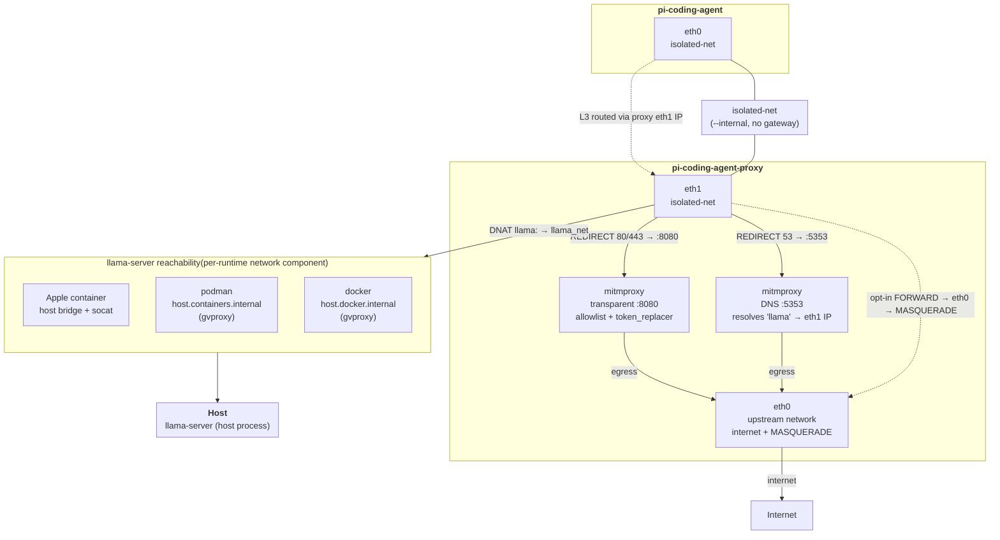

# pi-container

A containerized environment for running the `pi-coding-agent` with local LLM inference and full auditability. A transparent proxy container based on `mitmproxy` intercepts all HTTP/HTTPS/DNS traffic from the agent container, enforcing allowlisting and injecting secrets as needed. Supports macOS, Linux, and WSL2.

## Prerequisites

Before running, ensure you have the following installed on your host machine:

- **[uv](https://docs.astral.sh/uv/)**: Manages the Python environment and dependencies for the host-side build/run scripts.
  - On macOS: `brew install uv`
  - Other platforms: `curl -LsSf https://astral.sh/uv/install.sh | sh`
  - `build.sh` and `run.sh` invoke `uv run`, which creates `.venv` and installs the declared dependencies (including the `hf` CLI and `huggingface_hub`) automatically on first use. No manual `pip install` is needed.

- **Container Runtime**:

  The project supports three container runtimes. Set `CONTAINER_RUNTIME` or pass it via the build/run scripts:

  | Runtime | Platform | Installation |
  |---------|----------|--------------|
  | `container` | macOS | Download the [macOS installer (.pkg)](https://github.com/apple/container/releases/download/1.0.0/container-1.0.0-installer-signed.pkg) |
  | `docker` | macOS / Linux / WSL2 | [Install Docker](https://docs.docker.com/get-docker/) |
  | `podman` | macOS / Linux / WSL2 | `brew install podman` (macOS) or `sudo apt install podman` (Debian/Ubuntu) or your distro's package manager |

- **llama.cpp**: Specifically `llama-server`.
  - On macOS: `brew install llama.cpp`
  - On Linux (Debian/Ubuntu): `sudo apt install llama.cpp`
  - On Linux (other): [build from source](https://github.com/ggerganov/llama.cpp)
  - On WSL2: `sudo apt install llama.cpp`
- **socat** (Apple `container` runtime only — used to expose the host `llama-server` on the container bridge; not needed for podman/docker):
  - On macOS: `brew install socat`
  - On Linux (Debian/Ubuntu): `sudo apt install socat`
  - On WSL2: `sudo apt install socat`

Python dependencies (`huggingface_hub[cli]`, `pyyaml`) are declared in
`pyproject.toml` and installed by `uv` — you do not install them manually.

## Hardware Requirements

To run this environment comfortably, especially when utilizing the full 128k context window, the following is recommended:

- **Processor:**
  - Apple Silicon (M2-series Max/Ultra or above) for high memory bandwidth.
  - On Linux/WSL2: A modern multi-core CPU with AVX2 support.
- **Memory (RAM):**
  - **Minimum:** 32 GB (Performance may degrade with large contexts)
  - **Recommended:** 64 GB or more (For optimal performance)
- **Storage:** 50 GB of available SSD space.

## Architecture

The system consists of three components running as containers or processes:

1. **`llama-server`** (host process): Runs `llama.cpp`'s `llama-server` natively on the host. Provides OpenAI-compatible API endpoints for one or more local LLM models. Each model is configured via `pi-coding-agent/home/.pi/agent/models.json`.

2. **`pi-coding-agent-proxy`** (container): A transparent proxy container based on Debian with [mitmproxy](https://mitmproxy.org/). It intercepts the pi container's HTTP/HTTPS/DNS traffic; a self-signed CA certificate is installed into the pi container image so HTTPS can be decrypted. The mitmweb web UI is available at port 8081. Two [addons](pi-coding-agent-proxy/addons/) run on the intercepted traffic: an **allowlist** (blocks non-allowlisted hosts) and a **token_replacer** (redacts API keys, bearer tokens, cookies, JWTs). Non-HTTP protocols are **denied by default** — the agent cannot reach the internet except through the proxy, and only over protocols that are either inspected (HTTP/HTTPS/DNS) or explicitly opted in (see [Proxy egress policy](#proxy-egress-policy)).

3. **`pi-coding-agent`** (container): The main agent container. It runs on a multi-stage build from `node:26.3.1-trixie-slim`, with Python 3.14.6 compiled from source and `uv` for dependency management. The agent connects **only** to an internal `isolated-net` network, with its default route and DNS pointed at the proxy so all traffic is forced through it. How it reaches the host `llama-server` depends on the runtime: with Apple `container` (which shares an L2 bridge with the host) a host-side `socat` re-exposes llama-server on the bridge; with `podman`/`docker` (which run in a VM on macOS) the proxy reaches the host loopback via `host.containers.internal` — no socat needed.

### Network topology



The proxy's iptables rules enforce a **default-deny** forward policy — HTTP, HTTPS, and DNS from the agent are intercepted by mitmproxy (via `REDIRECT` to ports 8080/5353, bypassing the `FORWARD` chain entirely). Every other protocol is **denied by default**; opt-in forwarding (`PROXY_ALLOW_SSH`, `PROXY_ALLOW_SMTP`, `PROXY_ALLOW_GIT`, `PROXY_ALLOW_NTP`, custom TCP/UDP ports) uses plain NAT and is **not inspected** by mitmproxy. The `isolated-net` is created with `--internal` (no external gateway), so the agent has no route to the internet except the default route and DNS pointed at the proxy.

By default the whole stack is **IPv4-only**: the isolated network has no IPv6 subnet and both containers disable IPv6 (via sysctl) so no agent traffic can escape the transparent-proxy REDIRECT over v6. Set `IPV6_ENABLED=true` in `.env` to create the network with an IPv6 subnet (`--ipv6` for podman/docker, `--subnet-v6` for Apple `container`), mirror the proxy's REDIRECT/NAT/FORWARD rules in `ip6tables`, and give the agent an IPv6 default route through the proxy. This requires the container runtime **and** host to actually have IPv6 egress. Apple `container`'s `vmnet` networking NATs IPv4 only — a container gets no global IPv6 address or v6 route (verified) — so enabling it there logs a warning and v6 connections still fail. It is intended for **Linux hosts running podman/docker with working host IPv6**; leave it `false` on macOS.

<a name="proxy-egress-policy"></a>
### Proxy egress policy

Only **HTTP, HTTPS and DNS** are intercepted by mitmproxy (and subject to the
allowlist / token redaction). Every other protocol is **denied by default** —
the proxy's `iptables` `FORWARD` chain policy is `DROP`. The `llama-server` API
is permitted explicitly. To let the agent use another protocol (uninspected,
plain NAT), enable it in `.env`:

| Variable | Opens |
|----------|-------|
| `PROXY_ALLOW_SSH` | TCP 22 (e.g. git over SSH) |
| `PROXY_ALLOW_SMTP` | TCP 25, 465, 587 |
| `PROXY_ALLOW_GIT` | TCP 9418 (`git://`) |
| `PROXY_ALLOW_NTP` | UDP 123 |
| `PROXY_ALLOW_TCP_PORTS` | arbitrary TCP ports (comma-separated) |
| `PROXY_ALLOW_UDP_PORTS` | arbitrary UDP ports (comma-separated) |

> **Note:** protocols enabled via `PROXY_ALLOW_*` are forwarded **uninspected** —
> mitmproxy and the allowlist do not see them.

## Platform-Specific Notes

### Linux / WSL2

- **Container runtime**: Use `docker` or `podman` instead of the Apple `container` CLI. Set `CONTAINER_RUNTIME=docker` or `CONTAINER_RUNTIME=podman` in your `.env`.
- **Network**: The default bridge interface is `docker0` (Docker) or `podman0` (Podman). The proxy upstream network defaults to `bridge` (Docker) or `podman` (Podman). Override via `BRIDGE_INTERFACE` and `PROXY_UPSTREAM_NETWORK` in `.env` if needed.
- **LLaMA backend**: The `llama-server` binary runs natively on Linux/WSL2. For GPU acceleration on Linux, build llama.cpp with CUDA or ROCm support.
- **WSL2**: Ensure WSL2 is properly configured with a Linux distro. Docker Desktop or Podman can be used inside WSL2 for containerization.

### macOS

- **Container runtime**: The Apple `container` CLI is the default.
- **Network**: The default bridge interface is `bridge100` and the proxy upstream network defaults to `default`. These per-runtime defaults are applied automatically; `BRIDGE_INTERFACE` / `PROXY_UPSTREAM_NETWORK` are only needed to override them.
- **LLaMA backend**: Runs natively using Apple's Metal GPU acceleration.
- **podman / docker on macOS**: These run containers inside a Linux VM (no `podman0`/`docker0` bridge exists on the host), so `socat` is not used — the proxy reaches host `llama-server` via `host.containers.internal` (gvproxy). The runtime abstraction ([`src/runtimes.py`](src/runtimes.py)) handles these differences; the isolated network is created with `--internal --disable-dns` and the proxy is attached to both networks with pinned `eth0`/`eth1` interface names.

## Project Structure

```
.
├── build.sh                          # Build script (delegates to src/build.py)
├── run.sh                            # Run script (delegates to src/run.py)
├── .env.example                      # Example environment configuration
├── pyproject.toml                    # uv project: dependencies, dependency-groups, ruff/pytest config
├── uv.lock                           # Pinned dependency lockfile (committed)
├── .gitignore
│
├── src/                              # Python source for build and run utilities
│   ├── build.py                      # Builds proxy and agent container images
│   ├── run.py                        # Orchestration entrypoint: validation + main() lifecycle
│   ├── config.py                     # Shared constants (paths, env, logging) — no side effects
│   ├── runtimes.py                   # ContainerRuntime classes (Apple container / podman / docker)
│   ├── models.py                     # Model + ServerConfig/ModelConfig (download, checksum)
│   ├── server.py                     # Server: llama-server lifecycle (refcount, socat bridge)
│   ├── network.py                    # ContainerNetworkManager: proxy + isolated network lifecycle
│   ├── util.py                       # Shared utilities (env loading, validation, signals)
│   └── tests/                        # Pytest test suite
│       ├── conftest.py
│       ├── test_build.py
│       ├── test_models.py
│       ├── test_network.py
│       ├── test_runtimes.py
│       ├── test_server.py
│       └── test_util.py
│
├── pi-coding-agent/                  # Main agent container
│   ├── Containerfile                 # Multi-stage build (builder + runner)
│   ├── entrypoint.sh                 # Container entrypoint (default route via proxy, git config, uv venv)
│   └── home/.pi/agent/
│       ├── models.json               # LLM provider/server configuration
│       ├── AGENTS.md                 # Agent instructions
│       ├── config.json
│       └── extensions/               # Agent extensions (e.g. terminal-beautifier)
│
├── pi-coding-agent-proxy/            # Transparent proxy container
│   ├── Containerfile                 # mitmproxy + addon scripts/configs + pyyaml
│   ├── entrypoint.sh                 # iptables (redirect/DNAT, default-deny FORWARD) + mitmweb with addons
│   └── addons/
│       ├── allowlist/                # Hostname/IP allowlist addon (active)
│       └── token_replacer/           # Token redaction addon (API keys, Bearer tokens, cookies, JWTs) (active)
│
├── llama-server/                     # LLM server components
│   ├── models/                       # Downloaded GGUF model files (gitignored)
│   ├── chat-templates/               # Jinja chat templates for models
│   ├── logs/                         # llama-server log files (gitignored)
│   └── .locks/                       # Process lock files (gitignored)
│       └── local-gemma/              # Per-model lock directory
│           ├── .llama_server.pid
│           └── .llama_server_refcount
│
├── pi-coding-agent/setups/           # Model-specific setup directories
│   └── gemma-4-26b-a4b-it-qat-GGUF/  # Notes and config for specific model setups
│
└── .pi-container/                    # Host-side config mounted into proxy
    ├── token_replacer.yaml           # Token redaction rules
    ├── allowlist.yaml                # Hostname allowlist
    └── tmpfs.yaml                    # Transient tmpfs mount paths (volatile RAM disks)
```

## Getting Started

### 1. Configure Environment

Copy the example environment file and edit it:

```bash
cp .env.example .env
```

At minimum, **change `ADMIN_PASSWORD`** from `CHANGEME` to a strong password before running — the proxy's mitmweb UI will refuse to start with the default value.

### 2. Build the Container Images

```zsh
./build.sh
```

`build.sh` (and `run.sh`) run through `uv`, which creates the `.venv` and installs dependencies from `uv.lock` on first invocation — no separate setup step is required. To provision the environment ahead of time, run `uv sync`.

This builds two images in order: `pi-coding-agent-proxy:local` (the transparent proxy) and `pi-coding-agent:local` (the main agent). The agent image depends on the proxy image to copy the mitmproxy CA certificate into the system trust store.

### 3. Run the Agent

The `run.sh` script manages the entire lifecycle: it validates the environment, starts llama-server instances for each model defined in `models.json`, sets up the proxy container with its transparent proxy rules, and launches the pi container.

```sh
# Recommended: alias for convenience
alias pi="~/workspace/pi-container/run.sh"

# Run with an optional session ID
pi --session 1234abcd-ef56-78ab-cd90-1234abcd56ef
```

The script reads `pi-coding-agent/home/.pi/agent/models.json` to determine which LLM providers to start. Each entry defines a model (main, optional draft, and optional vision/mmproj files), download source, server flags, and OpenAI-compatible API configuration. The proxy container is managed with a refcount so it persists across multiple concurrent `pi` invocations.

### 4. Using the Agent

Once the server is ready, you can interact with the agent through the terminal. The current directory is mounted to `/workspace` inside the container, allowing the agent to read and write files in your project.

The agent's entrypoint automatically installs apt packages listed in `.pi-container/dependencies/apt/packages.txt` if present in the mounted workspace, points the container's default route and DNS at the proxy, and applies the host's git config. Reaching the host `llama-server` is handled by the proxy (via a host-side `socat` bridge for Apple `container`, or `host.containers.internal` for podman/docker) — see [Architecture](#architecture).

### 5. Using the Proxy

The transparent proxy web UI (mitmweb) is available at [http://127.0.0.1:8081](http://127.0.0.1:8081). See [pi-coding-agent-proxy/README.md](pi-coding-agent-proxy/README.md) for details on proxy operation, CA certificate installation, and addons.

## Environment Configuration

The application uses a `.env` file for managing environment-specific settings. See `.env.example` for all available options.

### Security

- **`ADMIN_PASSWORD`** MUST be changed from the default `CHANGEME` before running.
  The proxy's mitmweb UI at port 8081 will refuse to start with a default or empty password.
- **Model integrity**: Set `sha256` in `models.json` to verify downloaded model files.
  Without a checksum, downloads proceed without integrity verification.

### Run Configuration

The following environment variables are used by `build.sh` and `run.sh` to configure the container runtime, proxy, and `llama-server`:

| Variable | Description | Default |
|----------|-------------|---------|
| `PI_IMAGE_TAG` | The tag of the pi container image to run | `pi-coding-agent:local` |
| `PROXY_IMAGE_TAG` | The tag of the proxy container image to run | `pi-coding-agent-proxy:local` |
| `LLAMA_BIN` | Path to the `llama-server` executable | `llama-server` or `/opt/homebrew/bin/llama-server` |
| `BRIDGE_INTERFACE` | Host bridge interface for the `socat` bridge (Apple `container` only) | Per-runtime: `bridge100` / `podman0` / `docker0` |
| `PROXY_UPSTREAM_NETWORK` | The upstream network the proxy connects to for internet access | Per-runtime: `default` / `podman` / `bridge` |
| `LOG_LEVEL` | Log level | `INFO` |
| `ADMIN_PASSWORD` | Password for mitmproxy Web UI | `CHANGEME` |
| `MAX_STARTUP_ATTEMPTS` | Number of llama-server startup attempts per model | `2` |
| `CONTAINER_RUNTIME` | Container CLI to use (`container`, `docker`, or `podman`) | Auto-detected (prefers `container` > `docker` > `podman`) |
| `IPV6_ENABLED` | Whether the network stack supports IPv6. When `false`, IPv6 is explicitly disabled across both containers; when `true`, the isolated network gets an IPv6 subnet and the proxy mirrors its rules in `ip6tables` (requires runtime + host v6 egress) | `false` |
| `PROXY_ALLOW_SSH`, `PROXY_ALLOW_SMTP`, `PROXY_ALLOW_GIT`, `PROXY_ALLOW_NTP`, `PROXY_ALLOW_TCP_PORTS`, `PROXY_ALLOW_UDP_PORTS` | Opt-in egress for uninspected non-HTTP protocols (see [Proxy egress policy](#proxy-egress-policy)) | unset (denied) |

`BRIDGE_INTERFACE` and `PROXY_UPSTREAM_NETWORK` are derived from `CONTAINER_RUNTIME` and rarely need setting; provide them only to override the per-runtime default for your host.

### Token Replacer Secrets

The `token_replacer.yaml` config in `.pi-container/` may reference `${ENV:VAR}` values that must be set in the host environment before running. `run.py` scans this config and injects the values as environment variables into the proxy container. Override `ContainerNetworkManager._pull_secrets_from_config()` (in [`src/network.py`](src/network.py)) to integrate with a secret store (Vault, AWS Secrets Manager, etc.).

### Transient tmpfs Mounts

The `tmpfs.yaml` config in `.pi-container/` defines paths that are mounted as **tmpfs** (volatile RAM disks) inside the pi container. Data written to these paths is **lost when the container stops** — useful for build artifacts, caches, and temp files that should not persist across runs.

```yaml
# .pi-container/tmpfs.yaml
paths:
  - /workspace/.venv
  - /workspace/.pytest_cache
  - /workspace/.ruff_cache
  - /workspace/src/__pycache__
```

Each path is mounted at the same absolute location inside the container. On podman/docker, mounts use the `notmpcopyup` flag so they start empty (matching Apple `container` behavior) rather than copying the host's bind-mounted content into the tmpfs.

Paths are validated on startup — invalid paths are silently skipped. The list is deduplicated and sorted for deterministic output.

## Development

The host-side Python (`src/`) is managed with [uv](https://docs.astral.sh/uv/). Dependencies are declared in `pyproject.toml` and pinned in `uv.lock`.

```bash
# Provision / update the environment (runtime deps + the default `dev` group)
uv sync

# Run the project's test suite (src/tests)
uv run pytest

# Lint / format
uv run ruff check src
uv run ruff format src

# Run the mitmproxy proxy-addon tests (heavy `mitmproxy` dep — opt-in group)
uv run --group proxy-addons pytest pi-coding-agent-proxy/addons
```

The Python sources run directly from `src/` (uv treats the project as a
*virtual* project via `[tool.uv] package = false` — dependencies are installed
into `.venv` but the project itself is not built or installed). `build.sh` and
`run.sh` wrap `uv run --project <repo>`, so they use this environment while
still operating on the caller's working directory.
