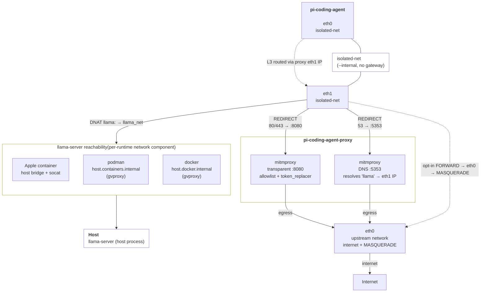

# Architecture

[← Documentation index](../README.md) · [Getting Started](getting-started.md) · [Configuration](configuration.md) · [Development](development.md)

The system consists of three components running as containers or processes:

1. **`llama-server`** (host process): Runs `llama.cpp`'s `llama-server` natively on the host. Provides OpenAI-compatible API endpoints for one or more local LLM models. Each model is configured via `<project>/.pi-container/agent/models.json` (seeded per-project from the `pi-coding-agent/default/` template on first run). Unlike the proxy, a llama-server is a shared host resource: it is keyed by provider **name + a fingerprint of its `serverCustomParameters`**, so projects with an identically-configured provider share one process (no double-loading a model), while a same-named provider with different parameters gets its own server (never a silent wrong-model attach).

2. **`pi-coding-agent-proxy`** (container): A transparent proxy container based on Debian with [mitmproxy](https://mitmproxy.org/). It intercepts the pi container's HTTP/HTTPS/DNS traffic; a self-signed CA certificate is installed into the pi container image so HTTPS can be decrypted. Each workspace gets its **own** proxy (and its own isolated network), named by a hash of the project path; its mitmweb web UI is published on an **auto-assigned host port, logged at startup**. Two [addons](proxy/overview.md#addons) run on the intercepted traffic: an **allowlist** (blocks non-allowlisted hosts) and a **token_replacer** (redacts API keys, bearer tokens, cookies, JWTs). Non-HTTP protocols are **denied by default** — the agent cannot reach the internet except through the proxy, and only over protocols that are either inspected (HTTP/HTTPS/DNS) or explicitly opted in (see [Proxy egress policy](#proxy-egress-policy)).

3. **`pi-coding-agent`** (container): The main agent container. It runs on a multi-stage build from `node:26.3.1-trixie-slim`, with Python 3.14.6 compiled from source and `uv` for dependency management. The agent connects **only** to an internal `isolated-net` network, with its default route and DNS pointed at the proxy so all traffic is forced through it. How it reaches the host `llama-server` depends on the runtime: with Apple `container` (which shares an L2 bridge with the host) a host-side `socat` re-exposes llama-server on the bridge; with `podman`/`docker` (which run in a VM on macOS) the proxy reaches the host loopback via `host.containers.internal` — no socat needed.

## Network topology



The proxy's iptables rules enforce a **default-deny** forward policy — HTTP, HTTPS, and DNS from the agent are intercepted by mitmproxy (via `REDIRECT` to ports 8080/5353, bypassing the `FORWARD` chain entirely). Every other protocol is **denied by default**; opt-in forwarding (per-project `.pi-container/config.yaml` under `egress.allow` — ssh/smtp/git/ntp + custom TCP/UDP ports) uses plain NAT and is **not inspected** by mitmproxy. The `isolated-net` is created with `--internal` (no external gateway), so the agent has no route to the internet except the default route and DNS pointed at the proxy.

By default the whole stack is **IPv4-only**: the isolated network has no IPv6 subnet and both containers disable IPv6 (via sysctl) so no agent traffic can escape the transparent-proxy REDIRECT over v6. Set `IPV6_ENABLED=true` in `.env` to create the network with an IPv6 subnet (`--ipv6` for podman/docker, `--subnet-v6` for Apple `container`), mirror the proxy's REDIRECT/NAT/FORWARD rules in `ip6tables`, and give the agent an IPv6 default route through the proxy. This requires the container runtime **and** host to actually have IPv6 egress. Apple `container`'s `vmnet` networking NATs IPv4 only — a container gets no global IPv6 address or v6 route (verified) — so enabling it there logs a warning and v6 connections still fail. It is intended for **Linux hosts running podman/docker with working host IPv6**; leave it `false` on macOS.

<a name="proxy-egress-policy"></a>
## Proxy egress policy

Only **HTTP, HTTPS and DNS** are intercepted by mitmproxy (and subject to the
allowlist / token redaction). Every other protocol is **denied by default** —
the proxy's `iptables` `FORWARD` chain policy is `DROP`. The `llama-server` API
is permitted explicitly. The egress policy is **per-project**: to let the agent
use another protocol (uninspected, plain NAT), opt it in under `egress.allow` in
this workspace's `.pi-container/config.yaml` (seeded deny-all on first run):

```yaml
# .pi-container/config.yaml
egress:
  allow:
    ssh: false            # TCP 22 (e.g. git over SSH)
    smtp: false           # TCP 25, 465, 587
    git: false            # TCP 9418 (git://)
    ntp: false            # UDP 123
    tcp_ports: []         # arbitrary extra TCP ports, e.g. [2222, 8443]
    udp_ports: []         # arbitrary extra UDP ports, e.g. [51820]
```

`run.py` reads this file and passes the corresponding `PROXY_ALLOW_*` values into
that project's proxy container, whose entrypoint opens the matching FORWARD rules.

> **Note:** protocols opted in here are forwarded **uninspected** — mitmproxy and
> the allowlist do not see them.

## Project Structure

```
.
├── build.sh                          # Build script (delegates to src/build.py)
├── run.sh                            # Run script (delegates to src/run.py)
├── .env.example                      # Example environment configuration
├── pyproject.toml                    # uv project: dependencies, dependency-groups, ruff/pytest config
├── uv.lock                           # Pinned dependency lockfile (committed)
├── .gitignore
│
├── src/                              # Python source for build and run utilities
│   ├── build.py                      # Builds proxy and agent container images
│   ├── run.py                        # Orchestration entrypoint: validation + main() lifecycle
│   ├── config.py                     # Shared constants (paths, env, logging) — no side effects
│   ├── runtimes.py                   # ContainerRuntime classes (Apple container / podman / docker)
│   ├── models.py                     # Model + ServerConfig/ModelConfig (download, checksum)
│   ├── server.py                     # Server: llama-server lifecycle (refcount, socat bridge)
│   ├── network.py                    # ContainerNetworkManager: proxy + isolated network lifecycle
│   ├── util.py                       # Shared utilities (env loading, validation, signals)
│   └── tests/                        # Pytest test suite
│       ├── conftest.py
│       ├── test_build.py
│       ├── test_models.py
│       ├── test_network.py
│       ├── test_runtimes.py
│       ├── test_server.py
│       └── test_util.py
│
├── pi-coding-agent/                  # Main agent container
│   ├── Containerfile                 # Multi-stage build (builder + runner)
│   ├── entrypoint.sh                 # Container entrypoint (default route via proxy, git config, uv venv)
│   └── default/                      # Template for <project>/.pi-container (seeded on first run)
│       ├── agent/                     # → .pi-container/agent
│       │   ├── models.json           # LLM provider/server configuration
│       │   ├── AGENTS.md             # Agent instructions
│       │   ├── config.json
│       │   ├── settings.json
│       │   └── .pi_ignore
│       ├── chat-templates/           # Jinja chat templates loaded by llama-server
│       ├── config.yaml               # Orchestration: resources, tmpfs, flow_export, egress
│       ├── allowlist.yaml            # Generic hostname allowlist (pypi/npm/github/apt)
│       └── token_replacer.yaml       # Generic token-redaction config
│
├── pi-coding-agent-proxy/            # Transparent proxy container
│   ├── Containerfile                 # mitmproxy + addon scripts/configs + pyyaml
│   ├── entrypoint.sh                 # iptables (redirect/DNAT, default-deny FORWARD) + mitmweb with addons
│   └── addons/
│       ├── allowlist/                # Hostname/IP allowlist addon (active)
│       └── token_replacer/           # Token redaction addon (API keys, Bearer tokens, cookies, JWTs) (active)
│
├── llama-server/                     # LLM server components
│   ├── models/                       # Downloaded GGUF model files (gitignored)
│   ├── chat-templates/               # Jinja chat templates for models
│   ├── logs/                         # llama-server log files (gitignored)
│   └── .locks/                       # Process lock files (gitignored)
│       └── local-gemma/              # Per-model lock directory
│           ├── .llama_server.pid
│           └── .llama_server_refcount
│
├── pi-coding-agent/setups/           # Model-specific setup directories
│   └── gemma-4-26b-a4b-it-qat-GGUF/  # Notes and config for specific model setups
│
└── .pi-container/                    # Per-project config (this repo's own; each workspace gets its own)
    ├── agent/                        # Agent launch config (models.json, sessions, …)
    ├── chat-templates/               # Jinja chat templates loaded by llama-server (per model)
    ├── config.yaml                   # Orchestration: resource limits, tmpfs, flow-export, egress
    ├── token_replacer.yaml           # Token redaction rules (mounted into this project's proxy)
    ├── allowlist.yaml                # Hostname allowlist (mounted into this project's proxy)
    └── exports/                      # Captured flow history for this project (gitignored)
```
