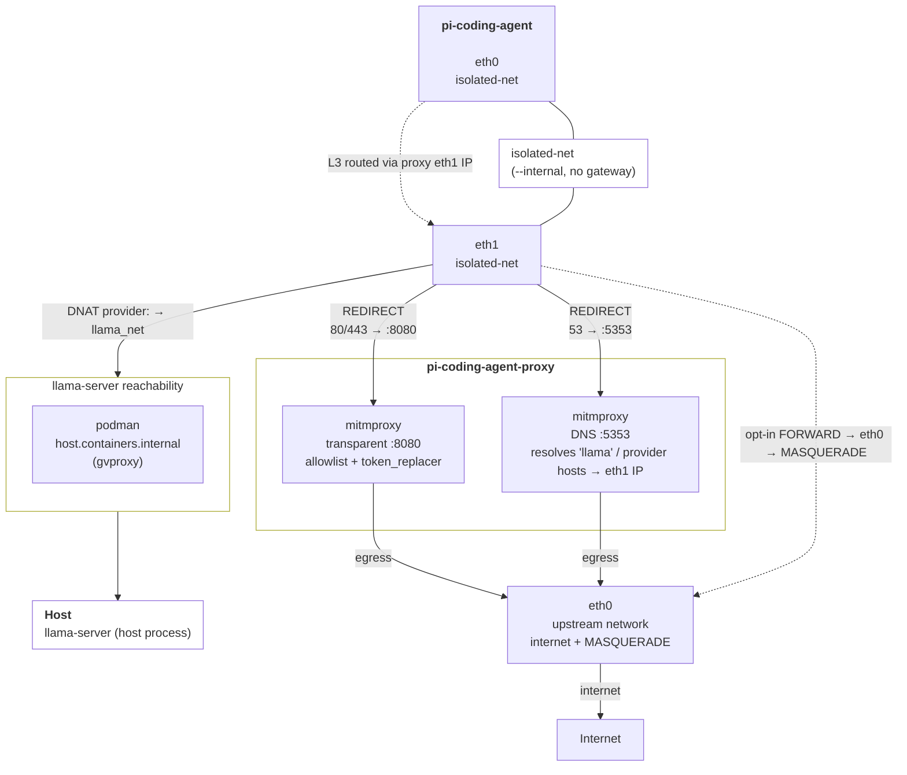
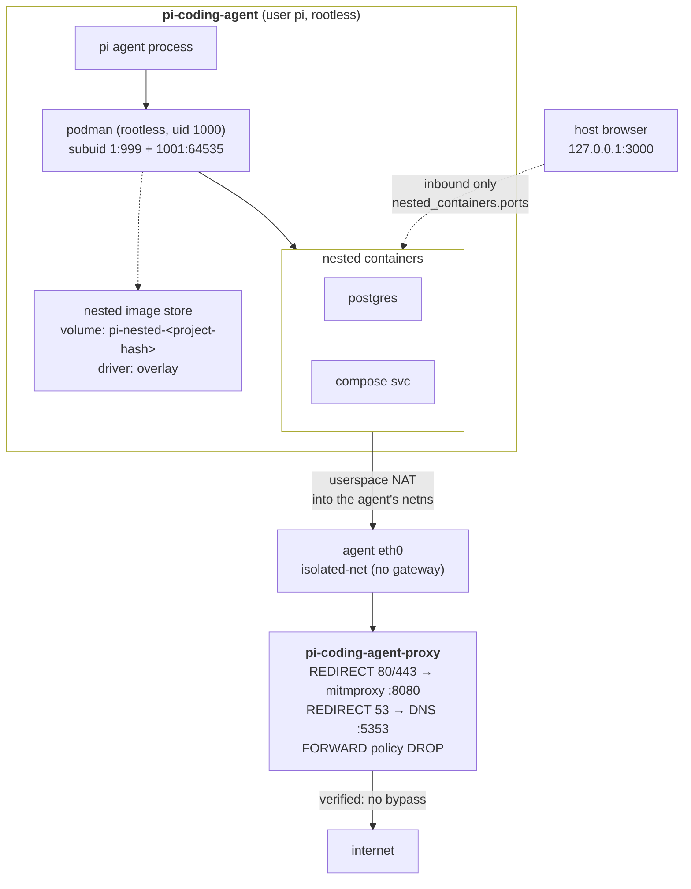

# Architecture


The system consists of three components running as containers or processes:

1. **`llama-server`** (host process): Runs `llama.cpp`'s `llama-server` natively on the host. It provides OpenAI-compatible API endpoints for one or more local LLM models. Each model uses a config file at `<project>/.pi-container/agent/models.json`. The system seeds this file from the `pi-coding-agent/default/` template on first run. Unlike the proxy, a llama-server is a shared host resource. It uses the provider **name plus a fingerprint of `serverCustomParameters`** as its key. Projects with an identically configured provider share one process. This avoids loading the model twice. A same-named provider with different parameters gets its own server. This prevents attaching the wrong model.

2. **`pi-coding-agent-proxy`** (container): A transparent proxy container based on Debian with [mitmproxy](https://mitmproxy.org/). It intercepts the pi container's HTTP, HTTPS, and DNS traffic. The system installs a self-signed CA certificate into the pi container image so it can decrypt HTTPS. Each workspace gets its **own** proxy and its own isolated network. The system names the proxy by a hash of the project path. Its mitmweb web UI runs on an **auto-assigned host port** that the system logs at startup. Two [addons](proxy/overview.md#addons) run on the intercepted traffic. The first is an **allowlist** that blocks non-allowlisted hosts. The second is a **token_replacer** that redacts API keys, bearer tokens, cookies, and JWTs. The system denies all non-HTTP protocols by default. The agent cannot reach the internet except through the proxy. The agent can only use protocols that the proxy inspects (HTTP, HTTPS, DNS) or that you explicitly opt in to (see [Proxy egress policy](#proxy-egress-policy)).

3. **`pi-coding-agent`** (container): The main agent container. The system builds it from `debian:trixie-slim`. It includes Node 26, Python 3.14.6, `uv` for dependency management, and (for nested containers) rootless podman plus `podman-compose`. The [toolchain builder image](#toolchain-builder-image) compiles all of these from source and copies them in. No workspace needs to install them. The agent connects **only** to an internal `isolated-net` network. Its default route and DNS point at the proxy so all traffic goes through it. The proxy reaches the host `llama-server` via `host.containers.internal` on podman for macOS or directly on Linux. This requires no socat. With `nested_containers.enabled`, the agent runs its own rootless podman inside itself. Those containers live in the agent's namespaces. Their traffic also goes through the proxy (see [Nested containers](#nested-containers)).

## Network topology


```mermaid
flowchart TB
    agent_eth["<b>pi-coding-agent</b><br/><br/>eth0<br/>isolated-net"]

    subgraph net["isolated-net<br/>(--internal, no gateway)"]
        direction TB
    end
    style net fill:none,text-align:left

    subgraph proxy["<b>pi-coding-agent-proxy</b>"]
        direction TB
        mitm["mitmproxy<br/>transparent :8080<br/>allowlist + token_replacer"]
        dns["mitmproxy<br/>DNS :5353<br/>resolves 'llama' / provider hosts → eth1 IP"]
    end
    style proxy fill:none,text-align:left

    subgraph host["<b>Host</b><br/>llama-server (host process)"]
        direction TB
    end
    style host fill:none,text-align:left

    eth1["eth1<br/>isolated-net"]
    eth0["eth0<br/>upstream network<br/>internet + MASQUERADE"]

    %% L3 routing: agent → isolated-net → proxy eth1
    agent_eth -.->|L3 routed via proxy eth1 IP| eth1
    agent_eth --- net
    net --- eth1

    %% Proxy internal: L4 interception & forwarding
    eth1 -->|REDIRECT<br/>80/443 → :8080| mitm
    eth1 -->|REDIRECT<br/>53 → :5353| dns
    eth1 -->|DNAT provider:<cp> → llama_net| llama_net
    mitm -->|egress| eth0
    dns -->|egress| eth0
    eth1 -.->|opt-in FORWARD → eth0 → MASQUERADE| eth0
    eth0 -->|internet| Out["Internet"]

    subgraph llama_net["llama-server reachability"]
        direction TB
        podman_net["podman<br/>host.containers.internal<br/>(gvproxy)"]
    end
    style llama_net fill:none,text-align:left

    llama_net --> host
```

The proxy's iptables rules enforce a **default-deny** forward policy. HTTP, HTTPS, and DNS from the agent go through mitmproxy. The proxy uses `REDIRECT` to ports 8080 and 5353. This bypasses the `FORWARD` chain entirely. The system denies every other protocol by default. Opt-in forwarding uses plain NAT. You configure it per-project in `.pi-container/config.yaml` under `egress.allow`. Options include ssh, smtp, git, ntp, and custom TCP or UDP ports. mitmproxy does **not inspect** these opt-in connections. The system creates `isolated-net` with `--internal`. This removes the external gateway. The agent has no route to the internet except the default route and DNS pointed at the proxy.

By default the whole stack is **IPv4-only**. The isolated network has no IPv6 subnet. Both containers disable IPv6 via sysctl. This prevents agent traffic from escaping the transparent-proxy REDIRECT over v6. Set `network.ipv6: true` in the project's `.pi-container/config.yaml` to enable IPv6. IPv6 mode creates the network with an IPv6 subnet (`--ipv6`). It mirrors the proxy's REDIRECT, NAT, and FORWARD rules in `ip6tables`. It gives the agent an IPv6 default route through the proxy. The container runtime **and** the host must both have IPv6 egress. This option targets **Linux hosts running podman with working host IPv6**. Leave it `false` on macOS.

<a name="proxy-egress-policy"></a>
## Proxy egress policy

mitmproxy intercepts only **HTTP, HTTPS, and DNS** (and applies the allowlist and token redaction). The system denies every other protocol by default. The proxy's `iptables` `FORWARD` chain policy is `DROP`. The system permits the `llama-server` API explicitly. The egress policy is **per-project**. To let the agent use another protocol (uninspected, plain NAT), opt it in under `egress.allow` in this workspace's `.pi-container/config.yaml`. The system seeds this file with deny-all on first run:

```yaml
# .pi-container/config.yaml
egress:
  allow:
    ssh: false            # TCP 22 (e.g. git over SSH)
    smtp: false           # TCP 25, 465, 587
    git: false            # TCP 9418 (git://)
    ntp: false            # UDP 123
    tcp_ports: []         # arbitrary extra TCP ports, e.g. [2222, 8443]
    udp_ports: []         # arbitrary extra UDP ports, e.g. [51820]
```

`run.py` reads this file. It passes the corresponding `PROXY_ALLOW_*` values into
that project's proxy container. The container's entrypoint opens the matching FORWARD rules.

> **Note:** protocols opted in here are forwarded **uninspected**. mitmproxy and
> the allowlist do not see them.

<a name="nested-containers"></a>
## Nested containers

The agent container is deliberately a dead end. None of the tooling to
start a container is normally present. Any task needing one (run Postgres for a
test, build and smoke-test an image, bring up a dev stack) fails outright.
Setting `nested_containers.enabled: true` in `.pi-container/config.yaml` gives the
agent its own **rootless podman inside its own container**.


```mermaid
flowchart TB
    subgraph agent["<b>pi-coding-agent</b> (user pi, rootless)"]
        direction TB
        pi["pi agent process"]
        pod["podman (rootless, uid 1000)<br/>subuid 1:999 + 1001:64535"]
        subgraph inner["nested containers"]
            direction LR
            c1["postgres"]
            c2["compose svc"]
        end
        store["nested image store<br/>volume: pi-nested-&lt;project-hash&gt;<br/>driver: overlay"]
    end
    style agent fill:none,text-align:left
    style inner fill:none,text-align:left

    eth0["agent eth0<br/>isolated-net (no gateway)"]
    proxy["<b>pi-coding-agent-proxy</b><br/>REDIRECT 80/443 → mitmproxy :8080<br/>REDIRECT 53 → DNS :5353<br/>FORWARD policy DROP"]
    host["host browser<br/>127.0.0.1:3000"]

    pi --> pod
    pod --> inner
    pod -.-> store
    inner -->|userspace NAT<br/>into the agent's netns| eth0
    eth0 --> proxy
    proxy -->|verified: no bypass| internet["internet"]
    host -.->|inbound only<br/>nested_containers.ports| inner
```

Containers the agent starts are **children**, not siblings. They live in the agent's
mount and network namespaces. They bind-mount the agent's view of `/workspace`
directly and inherit its routing. Rootless podman NATs their traffic **into the
parent namespace's stack**. Nested traffic leaves from the agent's own
interface with the agent's source address. It follows the agent's routes. The
proxy's existing `-i eth1` REDIRECT rules match nested traffic with **no
proxy-side changes**. A nested container on the `--internal` network cannot
reach a raw IP at all. The kernel's routing layer in
the agent's netns returns `Network unreachable`.

Traffic in the other direction needs plumbing. A browser on the host opens a UI that a nested
container serves. A nested
container's own `-p` publishes into the *agent's* namespace. The agent container
publishes nothing to the host. `nested_containers.ports.publish` adds that outer
hop as `-p` flags on the agent container. You declare the ports in config. A container's published ports are fixed at start. This works inbound only. It adds no
egress. The proxy is still the only route out.

The system **never** mounts the host runtime socket. `/var/run/docker.sock` is a
full-privilege API to the host runtime. Mounting it would break this security model. Nesting adds no `--privileged`, no `seccomp=unconfined`, and no
`--userns` override. It does relax three things in the agent container: SELinux
*type* confinement (`label=disable`), podman's masked or read-only `/proc` paths
(`unmask=ALL`), and the capability set (`--cap-add SYS_ADMIN`, which is
namespaced, so container uid 0 is still an unprivileged host user). The last two
were hard requirements of the inner runtime. Nesting is opt-in and off by default. See
[Nested containers](configuration.md#nested-containers) for the configuration
surface and the full trade-off. See `docs/design/nested-containers.md` for the
design and its verification log.

## Toolchain builder image

The system compiles three of the agent image's components from source in a separate image,
`pi-coding-agent-builder:local`. It then copies them into the prebuilt image files:

| Component | Otherwise | Built here | Why |
| --- | --- | --- | --- |
| Node.js | the `node:<ver>-trixie-slim` base image | 26.6.0 (official tarball, or `NODE_SOURCE=build` compiles it) | The base image tag chose the version, not this repo. And `v26.5.1` was a security release that the pinned tag predated. |
| CPython + `uv` + `podman-compose` | Debian has no `python3` in this image | 3.14.6 (PGO) | The workspace targets 3.14. Debian's would be a second interpreter tree at 3.13. The **proxy image takes this tree too** (see below) |
| `podman` | Debian trixie: 5.4.2 (Mar 2025) | 6.0.2 | Build tags, then version (see below) |
| `netavark`, `aardvark-dns` | Debian trixie: 1.14.0 | 2.0.0 | podman 6.0.0 "must be used with Netavark and Aardvark v2.0.0" |

The agent image's base is plain `debian:trixie-slim` because it builds Node here. The
`node:` images *are* `debian:trixie-slim` plus a Node tarball. This image uses the same
Debian with the tarball replaced by a build. Nothing else rides along on that tag.

The build-tag argument is the substantive one. podman's Makefile *derives* its
`BUILDTAGS` by probing the build host for installed `-dev` headers. The feature
set of a packaged binary is an accident of the packager's environment. You set them
explicitly to make it a decision. The decision for a rootless podman running
*inside* an unprivileged container differs from a distro's:

- **`seccomp`** — kept and load-bearing. Every nested container would run
  with unfiltered syscalls without it.
- **`containers_image_openpgp`** — Go-native OpenPGP instead of cgo `gpgme` plus the
  separate `podman-sequoia` library. This drops two runtime dependencies for signature
  policy this image does not use.
- **`exclude_graphdriver_btrfs`** — no btrfs driver and no `libbtrfs`. Nested storage
  is `overlay`, or `vfs` when overlay-on-overlay is unavailable.
- **no `systemd`** — a journald-capable podman also *defaults* to journald. There
  is no journal in the agent container. Without the tag the default is `k8s-file`.
- **no `libsubid`** — subuid and subgid are read from `/etc/subuid`. The image
  writes this file itself. This path works for nested user namespaces.

The result links only `libsqlite3`, `libseccomp`, `libc` and `libm`.

Each component builds in its **own stage** from a shared deps stage. The shipped
builder image is a `FROM scratch` that holds nothing but the four staged trees. Stage
independence matters most for Node. `NODE_SOURCE=build` takes ~65 minutes to compile Node.
Everything else takes a few minutes combined. A linear chain would make a podman bump
cost a full Node recompile.

Node is the one component with two modes. `NODE_SOURCE=prebuilt` (the default) stages
the official nodejs.org tarball. The `node:` base image installs this tarball too. This mode
is not a downgrade. It uses the same Node with the version pinned here instead of in a
tag. `NODE_SOURCE=build` compiles from source. This gives a trixie-native build rather than
the generic-glibc one. Node has no equivalent of podman's build tags. Both modes run the same parity
checks (`node`, `nodejs`, `npm`, `npx` present, version matches, full ICU, `Temporal`).

The builder stages each component at **its own root**: `/python/`,
`/node/`, `/podman/`, `/network/`. Every one of them already mirrors the layout it
lands in. A consumer copies the trees it wants straight onto `/`. The agent image
takes all four:

```dockerfile
COPY --from=pi-coding-agent-builder:local /python/ /
COPY --from=pi-coding-agent-builder:local /node/ /
COPY --from=pi-coding-agent-builder:local /podman/ /
COPY --from=pi-coding-agent-builder:local /network/ /
```

Keep separate roots instead of one merged `/out`. `COPY --from=<image>` can address
paths but not stages. Whatever this image's final stage lays down is all a consumer can
choose from. Keeping the components apart lets the **proxy image take
`/python/` alone**. It gets the same CPython and the same `uv` the agent runs. It gets no Node,
podman, or netavark in the TLS-terminating chokepoint. See
[Uniform Python across both images](#uniform-python-across-both-images).

Two further consequences worth knowing:

- **Project-specific image rebuilds never compile anything.** Before the split, a
  cache miss on the Python layer turned a workspace's rebuild into a ~10-minute PGO
  compile. Now it is a file copy.
- **A rebuilt builder invalidates project images**, the same way a rebuilt proxy
  does. `run.py` compares each project image's `pi-container.build.time` against
  both (see `_newest_shared_image_time()`).

### Uniform Python across both images

The proxy image used to be `python:<ver>-slim-trixie` with a `uv` binary pulled
separately from `ghcr.io/astral-sh/uv` by digest. That setup used a second interpreter and a
second `uv` pin next to the agent's. A different file bumped them by hand, and they drifted apart. The proxy could run a CPython patch release, an OpenSSL build, or a `uv` binary that the
agent had never seen. The one process that terminates TLS on every request the
agent makes needs a single answer to the question "which OpenSSL is that, exactly?"

Both images now take Python from the same build, and both refuse to start a build
without it:

- The proxy's base is plain `debian:trixie-slim` plus the runtime shared libraries the
  staged CPython's extension modules link against. A missing one causes a **build**
  failure. `python -c 'import bz2, ctypes, curses, lzma, readline, sqlite3, ssl,
  zlib'` runs right after the `COPY`. This catches the failure early instead of letting `import ssl` fail at
  interception time.
- `UV_PYTHON=/usr/local/bin/python3` and `UV_PYTHON_DOWNLOADS=never` make `uv sync`
  build the mitmproxy venv on the interpreter that you copied in. Without them a
  managed CPython download quietly reintroduces the drift.

Both images now carry the same CPython install. Every megabyte of it costs twice. `build-python.sh` trims the staged tree of what neither image can
reach. It takes it from 474 MB to 175 MB:

| Removed | Size | Why it is dead here |
| --- | --- | --- |
| `lib/python3.14/test/` | 157 MB | CPython's own regression suite. Only `python -m test` reaches it |
| `libpython3.14.a` (two copies, not hardlinks) | 134 MB | Needed only to *embed* CPython in a C program. Building a native wheel links nothing. An extension resolves its Python symbols from the interpreter that loads it |
| `idlelib`, `tkinter`, `turtledemo` | 10 MB | `tk-dev` is not installed. `_tkinter` was never built. `import tkinter` already fails |

This is the trim the official `python:` images make as well, minus their `*.pyc`
deletion. `/usr/local` is not writable by the agent's `pi` user. A removed `.pyc`
would never be regenerated. Every import would re-parse source for the life of the
image.

What it gives up is **embedding CPython in a C/C++ program**. `python-config --ldflags
--embed` still advertises `-lpython3.14` (sysconfig reports what the build configured,
not what is on disk). An embed link fails at `cannot find -lpython3.14`. Plain
`--ldflags` (the extension-module case) does not name it and is unaffected.

There is no **shared** `libpython` here either, and never was. `./configure` runs
without `--enable-shared`. `Py_ENABLE_SHARED` is `0`. The build links
the interpreter core into the `python3.14` binary. Tools that require one could not work in this image before the trim and
cannot now. These tools include PyInstaller, Nuitka, and `dlopen`-based embedding. Restoring the static archive would not change that. Making them work needs an
`--enable-shared` rebuild. That costs every workload a slightly slower interpreter to
serve a case that neither shipped image has.

The claim that matters is **proven at build time**, not asserted. The claim is that dropping `libpython*.a` does not break `pip install` or
`uv sync` building a wheel from source in a workspace. The build compiles a small C extension against the staged headers. It imports it with the staged interpreter. It creates a `python -m venv` to confirm
`ensurepip` and the stdlib came through. A failure there fails the build.

Net effect on the images: proxy 417 MB → 509 MB, agent 1.6 GB → 1.3 GB, builder 790 MB → 486 MB. The proxy gained a full interpreter and lost the slim base.

**Build order is therefore a dependency, not a preference:** builder → proxy → agent.
`build.py` builds them in that order. The proxy `COPY`s from the builder and the
agent `COPY`s from both.

Sources are pinned by content, not by tag. The build checks each git tag against an
expected **commit** (tags are mutable; the peeled commit sha is the real pin). The build checks every
tarball (CPython, Node, Go, Rust, the Rust vendor trees) against a SHA-256.
`build.sh` builds this image. Nothing else does.

**Every pin lives in `pi-coding-agent-builder/Containerfile`**, as an `ARG` on the stage
that consumes it (versions, git commits, tarball SHA-256s, and the pip hash lists alike).
The build scripts read them from the environment (podman exports build args to `RUN`). No script defaults any of them. `require_env` in `common.sh` fails the build and names
the missing `ARG`. The build does not fall back to a stale value baked into a script. So
you bump a component with one edit. `git log -p pi-coding-agent-builder/Containerfile`
is the toolchain's version history. Any pin can be overridden for a one-off build:

```bash
podman build --build-arg PODMAN_VERSION=v6.1.0 --build-arg PODMAN_COMMIT=<sha> \
    -f pi-coding-agent-builder/Containerfile .
```

The Rust pin is the one exception to per-stage declaration. It is declared *before* the
first `FROM` because two stages need it (netavark and aardvark-dns are Rust, and Node 26
implements `Temporal` in Rust). Those stages re-declare `ARG RUST_VERSION` with no
default. This is how a pre-`FROM` ARG is inherited. It gives one pin rather than two that can
drift apart.

## Project Structure

```
.
├── build.sh                          # Build script (delegates to src/build.py)
├── run.sh                            # Run script (delegates to src/run.py)
├── .env.example                      # Example environment configuration
├── pyproject.toml                    # uv project: dependencies, dependency-groups, ruff/pytest config
├── uv.lock                           # Pinned dependency lockfile (committed)
├── .gitignore
│
├── src/                              # Python source for build and run utilities
│   ├── build.py                      # Builds proxy and agent container images
│   ├── run.py                        # Orchestration entrypoint: validation + main() lifecycle
│   ├── config.py                     # Shared constants (paths, env, logging) — no side effects
│   ├── runtimes.py                   # ContainerRuntime abstraction (PodmanRuntime)
│   ├── models.py                     # Model + ServerConfig/ModelConfig (download, checksum)
│   ├── server.py                     # Server: llama-server lifecycle (refcount, socat bridge)
│   ├── network.py                    # ContainerNetworkManager: proxy + isolated network lifecycle
│   ├── util.py                       # Shared utilities (env loading, validation, signals)
│   └── tests/                        # Pytest test suite
│       ├── conftest.py
│       ├── test_build.py
│       ├── test_models.py
│       ├── test_network.py
│       ├── test_runtimes.py
│       ├── test_server.py
│       └── test_util.py
│
├── pi-coding-agent-builder/          # Toolchain builder image (not shipped; agent + proxy COPY --from it)
│   ├── Containerfile                 # EVERY version/commit/sha pin (as ARGs) + one stage per component
│   ├── common.sh                     # Verified fetch/clone, required-ARG check, memory-capped jobs, manifest
│   ├── build-node.sh                 # Node 26 (official tarball, or from source; replaces the node: image)
│   ├── build-python.sh               # CPython 3.14 (from source, PGO) + uv + podman-compose
│   ├── build-podman.sh               # podman 6.x with an explicit BUILDTAGS set (not Debian's 5.4)
│   └── build-network.sh              # netavark + aardvark-dns 2.0 (the pair podman 6 requires)
│
├── pi-coding-agent/                  # Main agent container
│   ├── Containerfile                 # Image definition (apt, toolchain COPY, pi, /etc/containers, CA)
│   ├── entrypoint.sh                 # Container entrypoint (default route via proxy, git config, uv venv)
│   └── default/                      # Template for <project>/.pi-container (seeded on first run)
│       ├── agent/                     # → .pi-container/agent
│       │   ├── models.json           # LLM provider/server configuration
│       │   ├── AGENTS.md             # Agent instructions
│       │   ├── config.json
│       │   ├── settings.json
│       │   └── .pi_ignore
│       ├── chat-templates/           # Jinja chat templates loaded by llama-server
│       ├── config.yaml               # Orchestration: resources, tmpfs, flow_export, egress, nested_containers
│       ├── allowlist.yaml            # Generic hostname allowlist (pypi/npm/github/apt)
│       └── token_replacer.yaml       # Generic token-redaction config
│
├── pi-coding-agent-proxy/            # Transparent proxy container
│   ├── Containerfile                 # mitmproxy + addon scripts/configs + pyyaml
│   ├── entrypoint.sh                 # iptables (redirect/DNAT, default-deny FORWARD) + mitmweb with addons
│   └── addons/
│       ├── allowlist/                # Hostname/IP allowlist addon (active)
│       └── token_replacer/           # Token redaction addon (API keys, Bearer tokens, cookies, JWTs) (active)
│
├── llama-server/                     # LLM server components
│   ├── models/                       # Downloaded GGUF model files (gitignored)
│   ├── chat-templates/               # Jinja chat templates for models
│   ├── logs/                         # llama-server log files (gitignored)
│   └── .locks/                       # Process lock files (gitignored)
│       └── local-gemma/              # Per-model lock directory
│           ├── .llama_server.pid
│           └── .llama_server_clients.json
│
├── pi-coding-agent/setups/           # Model-specific setup directories
│   └── gemma-4-26b-a4b-it-qat-GGUF/  # Notes and config for specific model setups
│
└── .pi-container/                    # Per-project config (this repo's own; each workspace gets its own)
    ├── agent/                        # Agent launch config (models.json, sessions, …)
    ├── chat-templates/               # Jinja chat templates loaded by llama-server (per model)
    ├── config.yaml                   # Orchestration: resource limits, tmpfs, flow-export, egress
    ├── token_replacer.yaml           # Token redaction rules (mounted into this project's proxy)
    ├── allowlist.yaml                # Hostname allowlist (mounted into this project's proxy)
    └── exports/                      # Captured flow history for this project (gitignored)
```
