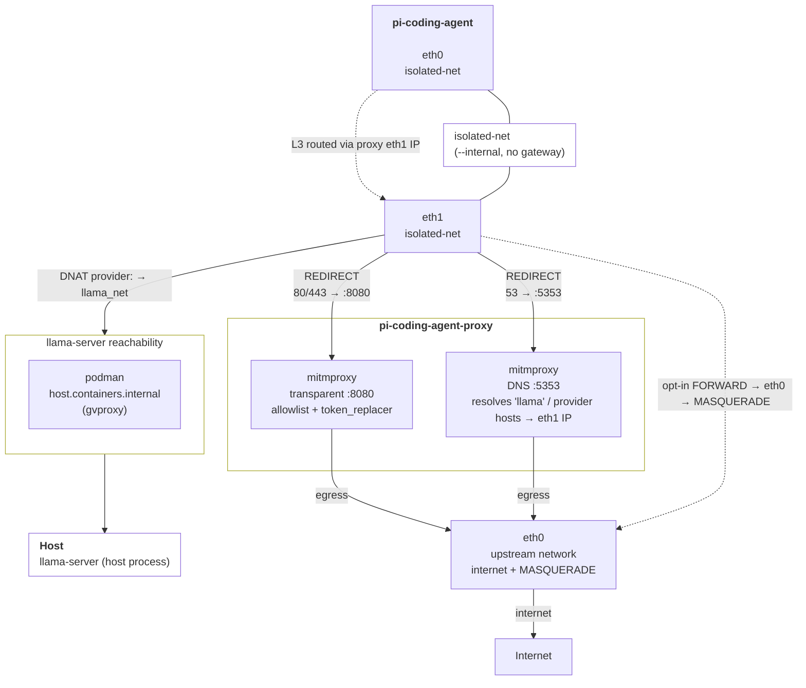

# Architecture

## Overview


```mermaid
flowchart TB
    agent_eth["<b>pi-coding-agent</b><br/><br/>eth0<br/>isolated-net"]

    subgraph net["isolated-net<br/>(--internal, no gateway)"]
        direction TB
    end
    style net fill:none,text-align:left

    subgraph proxy["<b>pi-coding-agent-proxy</b>"]
        direction TB
        mitm["mitmproxy<br/>transparent :8080<br/>allowlist + token_replacer"]
        dns["mitmproxy<br/>DNS :5353<br/>resolves 'llama' / provider hosts → eth1 IP"]
    end
    style proxy fill:none,text-align:left

    subgraph host["<b>Host</b><br/>llama-server (host process)"]
        direction TB
    end
    style host fill:none,text-align:left

    eth1["eth1<br/>isolated-net"]
    eth0["eth0<br/>upstream network<br/>internet + MASQUERADE"]

    %% L3 routing: agent → isolated-net → proxy eth1
    agent_eth -.->|L3 routed via proxy eth1 IP| eth1
    agent_eth --- net
    net --- eth1

    %% Proxy internal: L4 interception & forwarding
    eth1 -->|REDIRECT<br/>80/443 → :8080| mitm
    eth1 -->|REDIRECT<br/>53 → :5353| dns
    eth1 -->|DNAT provider:<cp> → llama_net| llama_net
    mitm -->|egress| eth0
    dns -->|egress| eth0
    eth1 -.->|opt-in FORWARD → eth0 → MASQUERADE| eth0
    eth0 -->|internet| Out["Internet"]

    subgraph llama_net["llama-server reachability"]
        direction TB
        podman_net["podman<br/>host.containers.internal<br/>(gvproxy)"]
    end
    style llama_net fill:none,text-align:left

    llama_net --> host
```

The key components of the system are

1. **`llama-server`** (host process): Runs `llama.cpp`'s `llama-server` natively on the host. It provides OpenAI-compatible API endpoints for one or more local LLM models. Each model uses a config file at `<project>/.pi-container/agent/models.json`. The system seeds this file from the `pi-coding-agent/default/` template on first run. Unlike the proxy, a llama-server is a shared host resource. It uses the provider **name plus a fingerprint of `serverCustomParameters`** as its key. Projects with an identically configured provider share one process. This avoids loading the model twice. A same-named provider with different parameters gets its own server. This prevents attaching the wrong model.

2. **`pi-coding-agent-proxy`** (container): A transparent proxy container based on Debian with [mitmproxy](https://mitmproxy.org/). It intercepts the pi container's HTTP, HTTPS, and DNS traffic. The system installs a self-signed CA certificate into the pi container image so it can decrypt HTTPS. Each workspace gets its **own** proxy and its own isolated network. The system names the proxy by a hash of the project path. Its mitmweb web UI runs on an **auto-assigned host port** that the system logs at startup. Two [addons](proxy/overview.md#addons) run on the intercepted traffic. The first is an **allowlist** that blocks non-allowlisted hosts. The second is a **token_replacer** that redacts API keys, bearer tokens, cookies, and JWTs. The system denies all non-HTTP protocols by default. The agent cannot reach the internet except through the proxy. The agent can only use protocols that the proxy inspects (HTTP, HTTPS, DNS) or that you explicitly opt in to (see [Proxy egress policy](design-details.md#proxy-egress-policy)).

3. **`pi-coding-agent`** (container): The main agent container. The system builds it from `debian:trixie-slim`. It includes Node 26, Python 3.14.6, `uv` for dependency management, and (for nested containers) rootless podman plus `podman-compose`. The [toolchain builder image](design-details.md#toolchain-builder-image) compiles all of these from source and copies them in. No workspace needs to install them. The agent connects **only** to an internal `isolated-net` network. Its default route and DNS point at the proxy so all traffic goes through it. The proxy reaches the host `llama-server` via `host.containers.internal` on podman for macOS or directly on Linux. This requires no socat. With `nested_containers.enabled`, the agent runs its own rootless podman inside itself. Those containers live in the agent's namespaces. Their traffic also goes through the proxy (see [Nested containers](design-details.md#nested-containers)).

<a name="network-topology"></a>
## Networking

The proxy's iptables rules enforce a **default-deny** forward policy. HTTP, HTTPS, and DNS from the agent go through mitmproxy. The proxy uses `REDIRECT` to ports 8080 and 5353. This bypasses the `FORWARD` chain entirely. The system denies every other protocol by default. Opt-in forwarding uses plain NAT. You configure it per-project in `.pi-container/config.yaml` under `egress.allow`. Options include ssh, smtp, git, ntp, and custom TCP or UDP ports. mitmproxy does **not inspect** these opt-in connections. The system creates `isolated-net` with `--internal`. This removes the external gateway. The agent has no route to the internet except the default route and DNS pointed at the proxy.

By default the whole stack is **IPv4-only**. The isolated network has no IPv6 subnet. Both containers disable IPv6 via sysctl. This prevents agent traffic from escaping the transparent-proxy REDIRECT over v6. Set `network.ipv6: true` in the project's `.pi-container/config.yaml` to enable IPv6. IPv6 mode creates the network with an IPv6 subnet (`--ipv6`). It mirrors the proxy's REDIRECT, NAT, and FORWARD rules in `ip6tables`. It gives the agent an IPv6 default route through the proxy. The container runtime **and** the host must both have IPv6 egress. This option targets **Linux hosts running podman with working host IPv6**. Leave it `false` on macOS.


## Startup orchestration & parallel initialization

When `pi` runs (`src/run.py`), startup dependencies are orchestrated concurrently using `start_dependencies_parallel()` in `src/containers.py`:

```mermaid
flowchart TD
    Sweep["1. Crash Recovery & Sweepers<br/>(reap dead servers, proxies, agent containers)"] --> Parallel

    subgraph Parallel ["2. Parallel Dependency Initialization"]
        direction TB
        S1["llama-server 1<br/>(allocate port → load weights → /health)"]
        S2["llama-server 2<br/>(allocate port → load weights → /health)"]
        Proxy["pi-coding-agent-proxy<br/>(create network → run container → mitmweb probe)"]
    end

    S1 -.->|port_ready_event (~15ms)| Proxy
    S2 -.->|port_ready_event (~15ms)| Proxy

    S1 --> Barrier["3. Health Readiness Barrier"]
    S2 --> Barrier
    Proxy --> Barrier

    Barrier -->|All healthy| Agent["4. Start pi-coding-agent<br/>(attach network, route default gateway + DNS to proxy)"]
    Barrier -.->|Any failure / SIGINT| Cleanup["Rollback & Teardown via ExitStack"]
```

### Dependency lifecycle stages

1. **Crash recovery & orphan sweeping**:
    - `containers.sweep_orphaned_servers()` stops host `llama-server` processes whose client sessions have terminated.
    - `containers.sweep_orphaned_proxies()` cleans up stale proxy locks, stops orphaned proxy containers, and removes dangling bridge networks.
    - `containers.cleanup_orphaned_agent_containers()` removes exited or abandoned agent containers from prior crashed runs.

2. **Parallel dependency startup (`start_dependencies_parallel`)**:
    - **Multi-server concurrency**: If multiple local models are configured in `models.json`, all `llama-server` instances launch in parallel worker threads, downloading models and loading weights into memory/VRAM concurrently.
    - **Port readiness signaling**: Each `Server` assigns its host port immediately upon process spawn and signals `port_ready_event` (~15ms).
    - **Concurrent proxy initialization**: `ContainerNetworkManager` builds `LLAMA_PORTS` port forwarding rules as soon as server ports are allocated, launching the proxy container and polling mitmweb health in parallel with server weight loading.
    - **Health synchronization barrier**: The coordinator thread waits for all servers and the proxy container to complete health verification.
    - **Clean rollback via `ExitStack`**: If any server or the proxy fails to start (e.g. OOM or timeout), `ExitStack` automatically cancels outstanding startup tasks and cleans up all started containers and processes.

3. **Agent container launch**:
    - Inspects the running proxy's internal interface IP and provisions shadow volumes and tmpfs mounts.
    - Launches `pi-coding-agent` attached to the isolated bridge network with default route and DNS directed to the proxy.

For in-depth explanations of proxy egress forwarding rules, nested container architecture, and the toolchain builder image, see [Design details](design-details.md).

## Project Structure

```
.
├── build.sh                          # Build script (delegates to src/build.py)
├── run.sh                            # Run script (delegates to src/run.py)
├── .env.example                      # Example environment configuration
├── pyproject.toml                    # uv project: dependencies, dependency-groups, ruff/pytest config
├── uv.lock                           # Pinned dependency lockfile (committed)
├── .gitignore
│
├── src/                              # Python source for build and run utilities
│   ├── build.py                      # Builds proxy and agent container images
│   ├── run.py                        # Orchestration entrypoint: validation + main() lifecycle
│   ├── config.py                     # Shared constants (paths, env, logging) — no side effects
│   ├── runtimes.py                   # ContainerRuntime abstraction (PodmanRuntime)
│   ├── models.py                     # Model + ServerConfig/ModelConfig (download, checksum)
│   ├── server.py                     # Server: llama-server lifecycle & multi-client refcounting
│   ├── network.py                    # ContainerNetworkManager: proxy + isolated network lifecycle
│   ├── containers.py                 # Dependency orchestration (start_dependencies_parallel, sweeper)
│   ├── images.py                     # Image resolution, hashing, building, and pruning
│   ├── volumes.py                    # Named shadow and nested container volume management
│   ├── project.py                    # Project key derivation, project scoping, and template seeding
│   ├── security.py                   # Security configuration and mount policy validation
│   ├── yaml_strict.py                # Strict duplicate-key YAML parser
│   ├── util.py                       # Shared utilities (env loading, validation, port allocation, signals)
│   └── tests/                        # Pytest test suite
│       ├── conftest.py
│       ├── test_build.py
│       ├── test_config_schema.py
│       ├── test_containers.py
│       ├── test_flow_export.py
│       ├── test_images.py
│       ├── test_models.py
│       ├── test_network.py
│       ├── test_project.py
│       ├── test_run.py
│       ├── test_runtimes.py
│       ├── test_security.py
│       ├── test_server.py
│       ├── test_util.py
│       ├── test_volumes.py
│       └── test_yaml_strict.py
│
├── pi-coding-agent-builder/          # Toolchain builder image (not shipped; agent + proxy COPY --from it)
│   ├── Containerfile                 # EVERY version/commit/sha pin (as ARGs) + one stage per component
│   ├── common.sh                     # Verified fetch/clone, required-ARG check, memory-capped jobs, manifest
│   ├── build-node.sh                 # Node 26 (official tarball, or from source; replaces the node: image)
│   ├── build-python.sh               # CPython 3.14 (from source, PGO) + uv + podman-compose
│   ├── build-podman.sh               # podman 6.x with an explicit BUILDTAGS set (not Debian's 5.4)
│   └── build-network.sh              # netavark + aardvark-dns 2.0 (the pair podman 6 requires)
│
├── pi-coding-agent/                  # Main agent container
│   ├── Containerfile                 # Image definition (apt, toolchain COPY, pi, /etc/containers, CA)
│   ├── entrypoint.sh                 # Container entrypoint (default route via proxy, git config, uv venv)
│   └── default/                      # Template for <project>/.pi-container (seeded on first run)
│       ├── agent/                     # → .pi-container/agent
│       │   ├── models.json           # LLM provider/server configuration
│       │   ├── AGENTS.md             # Agent instructions
│       │   ├── config.json
│       │   ├── settings.json
│       │   └── .pi_ignore
│       ├── chat-templates/           # Jinja chat templates loaded by llama-server
│       ├── config.yaml               # Orchestration: resources, tmpfs, flow_export, egress, nested_containers
│       ├── allowlist.yaml            # Generic hostname allowlist (pypi/npm/github/apt)
│       └── token_replacer.yaml       # Generic token-redaction config
│
├── pi-coding-agent-proxy/            # Transparent proxy container
│   ├── Containerfile                 # mitmproxy + addon scripts/configs + pyyaml
│   ├── entrypoint.sh                 # iptables (redirect/DNAT, default-deny FORWARD) + mitmweb with addons
│   └── addons/
│       ├── allowlist/                # Hostname/IP allowlist addon (active)
│       └── token_replacer/           # Token redaction addon (API keys, Bearer tokens, cookies, JWTs) (active)
│
├── llama-server/                     # LLM server components
│   ├── models/                       # Downloaded GGUF model files (gitignored)
│   ├── chat-templates/               # Jinja chat templates for models
│   ├── logs/                         # llama-server log files (gitignored)
│   └── .locks/                       # Process lock files (gitignored)
│       └── local-gemma/              # Per-model lock directory
│           ├── .llama_server.pid
│           └── .llama_server_clients.json
│
├── pi-coding-agent/setups/           # Model-specific setup directories
│   └── gemma-4-26b-a4b-it-qat-GGUF/  # Notes and config for specific model setups
│
└── .pi-container/                    # Per-project config (this repo's own; each workspace gets its own)
    ├── agent/                        # Agent launch config (models.json, sessions, …)
    ├── chat-templates/               # Jinja chat templates loaded by llama-server (per model)
    ├── config.yaml                   # Orchestration: resource limits, tmpfs, flow-export, egress
    ├── token_replacer.yaml           # Token redaction rules (mounted into this project's proxy)
    ├── allowlist.yaml                # Hostname allowlist (mounted into this project's proxy)
    └── exports/                      # Captured flow history for this project (gitignored)
```
