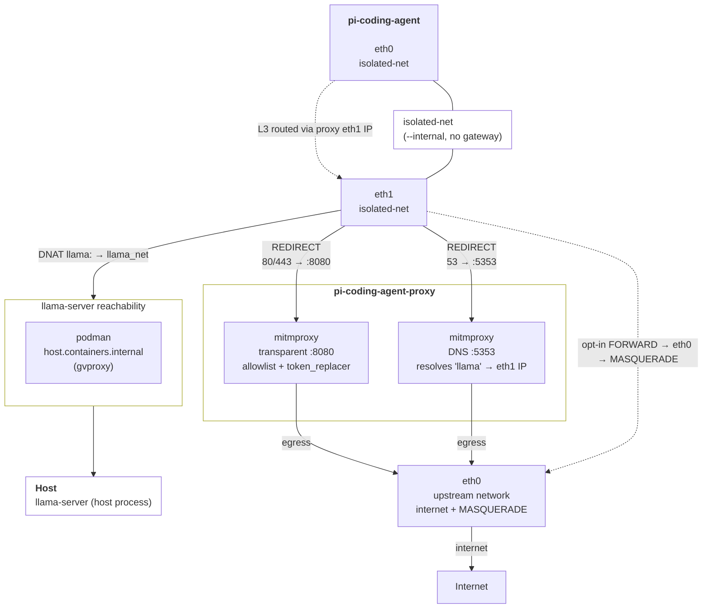
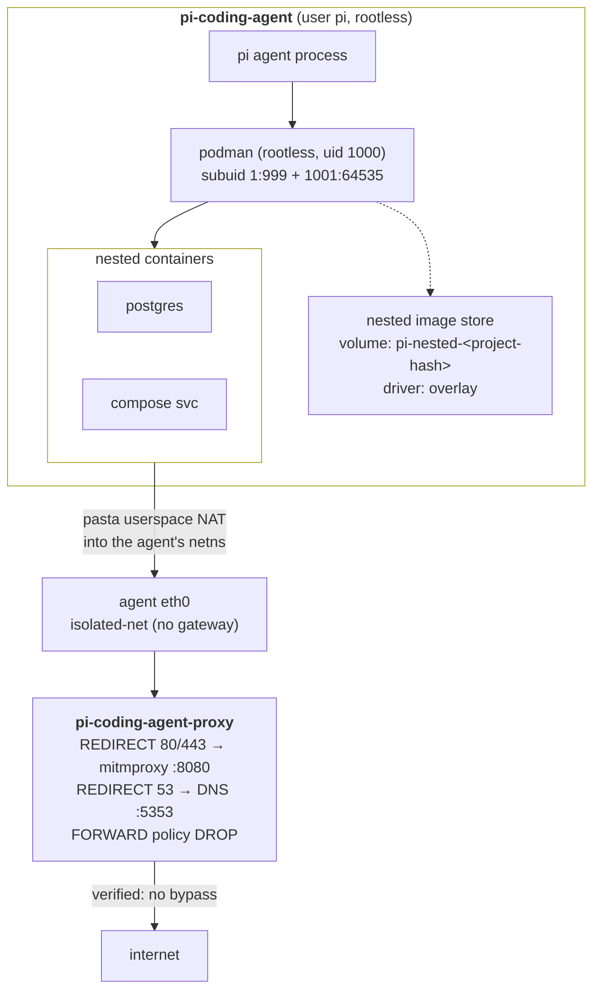

# Architecture


The system consists of three components running as containers or processes:

1. **`llama-server`** (host process): Runs `llama.cpp`'s `llama-server` natively on the host. Provides OpenAI-compatible API endpoints for one or more local LLM models. Each model is configured via `<project>/.pi-container/agent/models.json` (seeded per-project from the `pi-coding-agent/default/` template on first run). Unlike the proxy, a llama-server is a shared host resource: it is keyed by provider **name + a fingerprint of its `serverCustomParameters`**, so projects with an identically-configured provider share one process (no double-loading a model), while a same-named provider with different parameters gets its own server (never a silent wrong-model attach).

2. **`pi-coding-agent-proxy`** (container): A transparent proxy container based on Debian with [mitmproxy](https://mitmproxy.org/). It intercepts the pi container's HTTP/HTTPS/DNS traffic; a self-signed CA certificate is installed into the pi container image so HTTPS can be decrypted. Each workspace gets its **own** proxy (and its own isolated network), named by a hash of the project path; its mitmweb web UI is published on an **auto-assigned host port, logged at startup**. Two [addons](proxy/overview.md#addons) run on the intercepted traffic: an **allowlist** (blocks non-allowlisted hosts) and a **token_replacer** (redacts API keys, bearer tokens, cookies, JWTs). Non-HTTP protocols are **denied by default** — the agent cannot reach the internet except through the proxy, and only over protocols that are either inspected (HTTP/HTTPS/DNS) or explicitly opted in (see [Proxy egress policy](#proxy-egress-policy)).

3. **`pi-coding-agent`** (container): The main agent container. It is built from `debian:trixie-slim`, with Node 26, Python 3.14.6, `uv` for dependency management, and (for nested containers) rootless podman plus `podman-compose` — all compiled from source in the [toolchain builder image](#toolchain-builder-image) and copied in, so no workspace has to install them. The agent connects **only** to an internal `isolated-net` network, with its default route and DNS pointed at the proxy so all traffic is forced through it. The proxy reaches the host `llama-server` via `host.containers.internal` (podman on macOS) or directly on Linux — no socat needed. With `nested_containers.enabled`, the agent can also run its own rootless podman inside itself; those containers are children in its namespaces, so their traffic egresses through the proxy too (see [Nested containers](#nested-containers)).

## Network topology


```mermaid
flowchart TB
    agent_eth["<b>pi-coding-agent</b><br/><br/>eth0<br/>isolated-net"]

    subgraph net["isolated-net<br/>(--internal, no gateway)"]
        direction TB
    end
    style net fill:none,text-align:left

    subgraph proxy["<b>pi-coding-agent-proxy</b>"]
        direction TB
        mitm["mitmproxy<br/>transparent :8080<br/>allowlist + token_replacer"]
        dns["mitmproxy<br/>DNS :5353<br/>resolves 'llama' → eth1 IP"]
    end
    style proxy fill:none,text-align:left

    subgraph host["<b>Host</b><br/>llama-server (host process)"]
        direction TB
    end
    style host fill:none,text-align:left

    eth1["eth1<br/>isolated-net"]
    eth0["eth0<br/>upstream network<br/>internet + MASQUERADE"]

    %% L3 routing: agent → isolated-net → proxy eth1
    agent_eth -.->|L3 routed via proxy eth1 IP| eth1
    agent_eth --- net
    net --- eth1

    %% Proxy internal: L4 interception & forwarding
    eth1 -->|REDIRECT<br/>80/443 → :8080| mitm
    eth1 -->|REDIRECT<br/>53 → :5353| dns
    eth1 -->|DNAT llama:<cp> → llama_net| llama_net
    mitm -->|egress| eth0
    dns -->|egress| eth0
    eth1 -.->|opt-in FORWARD → eth0 → MASQUERADE| eth0
    eth0 -->|internet| Out["Internet"]

    subgraph llama_net["llama-server reachability"]
        direction TB
        podman_net["podman<br/>host.containers.internal<br/>(gvproxy)"]
    end
    style llama_net fill:none,text-align:left

    llama_net --> host
```

The proxy's iptables rules enforce a **default-deny** forward policy — HTTP, HTTPS, and DNS from the agent are intercepted by mitmproxy (via `REDIRECT` to ports 8080/5353, bypassing the `FORWARD` chain entirely). Every other protocol is **denied by default**; opt-in forwarding (per-project `.pi-container/config.yaml` under `egress.allow` — ssh/smtp/git/ntp + custom TCP/UDP ports) uses plain NAT and is **not inspected** by mitmproxy. The `isolated-net` is created with `--internal` (no external gateway), so the agent has no route to the internet except the default route and DNS pointed at the proxy.

By default the whole stack is **IPv4-only**: the isolated network has no IPv6 subnet and both containers disable IPv6 (via sysctl) so no agent traffic can escape the transparent-proxy REDIRECT over v6. Set `network.ipv6: true` in the project's `.pi-container/config.yaml` to create the network with an IPv6 subnet (`--ipv6`), mirror the proxy's REDIRECT/NAT/FORWARD rules in `ip6tables`, and give the agent an IPv6 default route through the proxy. This requires the container runtime **and** host to actually have IPv6 egress. It is intended for **Linux hosts running podman with working host IPv6**; leave it `false` on macOS.

<a name="proxy-egress-policy"></a>
## Proxy egress policy

Only **HTTP, HTTPS and DNS** are intercepted by mitmproxy (and subject to the
allowlist / token redaction). Every other protocol is **denied by default** —
the proxy's `iptables` `FORWARD` chain policy is `DROP`. The `llama-server` API
is permitted explicitly. The egress policy is **per-project**: to let the agent
use another protocol (uninspected, plain NAT), opt it in under `egress.allow` in
this workspace's `.pi-container/config.yaml` (seeded deny-all on first run):

```yaml
# .pi-container/config.yaml
egress:
  allow:
    ssh: false            # TCP 22 (e.g. git over SSH)
    smtp: false           # TCP 25, 465, 587
    git: false            # TCP 9418 (git://)
    ntp: false            # UDP 123
    tcp_ports: []         # arbitrary extra TCP ports, e.g. [2222, 8443]
    udp_ports: []         # arbitrary extra UDP ports, e.g. [51820]
```

`run.py` reads this file and passes the corresponding `PROXY_ALLOW_*` values into
that project's proxy container, whose entrypoint opens the matching FORWARD rules.

> **Note:** protocols opted in here are forwarded **uninspected** — mitmproxy and
> the allowlist do not see them.

<a name="nested-containers"></a>
## Nested containers

The agent container is deliberately a dead end, which means none of the tooling to
start a container is normally present — so any task needing one (run Postgres for a
test, build and smoke-test an image, bring up a dev stack) fails outright.
Setting `nested_containers.enabled: true` in `.pi-container/config.yaml` gives the
agent its own **rootless podman, inside its own container**.


```mermaid
flowchart TB
    subgraph agent["<b>pi-coding-agent</b> (user pi, rootless)"]
        direction TB
        pi["pi agent process"]
        pod["podman (rootless, uid 1000)<br/>subuid 1:999 + 1001:64535"]
        subgraph inner["nested containers"]
            direction LR
            c1["postgres"]
            c2["compose svc"]
        end
        store["nested image store<br/>volume: pi-nested-&lt;project-hash&gt;<br/>driver: overlay"]
    end
    style agent fill:none,text-align:left
    style inner fill:none,text-align:left

    eth0["agent eth0<br/>isolated-net (no gateway)"]
    proxy["<b>pi-coding-agent-proxy</b><br/>REDIRECT 80/443 → mitmproxy :8080<br/>REDIRECT 53 → DNS :5353<br/>FORWARD policy DROP"]

    pi --> pod
    pod --> inner
    pod -.-> store
    inner -->|pasta userspace NAT<br/>into the agent's netns| eth0
    eth0 --> proxy
    proxy -->|verified: no bypass| internet["internet"]
```

Containers the agent starts are **children**, not siblings: they live in the agent's
mount and network namespaces, so they bind-mount the agent's view of `/workspace`
directly and inherit its routing. Rootless podman connects them through
`pasta`, which performs userspace NAT **into the parent namespace's
stack** — so nested traffic leaves from the agent's own interface, with the agent's
source address, subject to the agent's routes. The proxy's existing `-i eth1`
REDIRECT rules therefore match nested traffic with **no proxy-side changes**, and a
nested container on the `--internal` network cannot reach a raw IP at all
(`Network unreachable`, from the kernel's routing layer in the agent's netns).

The host runtime socket is **never** mounted — `/var/run/docker.sock` is a
full-privilege API to the host runtime and would delete this model rather than
weaken it — and nesting adds no `--privileged`, no `seccomp=unconfined` and no
`--userns` override. It does relax three things in the agent container: SELinux
*type* confinement (`label=disable`), podman's masked/read-only `/proc` paths
(`unmask=ALL`), and the capability set (`--cap-add SYS_ADMIN`, which is
namespaced — container uid 0 is still an unprivileged host user). The last two
were measured as hard requirements of the inner runtime, not chosen. That is why
nesting is opt-in and off by default. See
[Nested containers](configuration.md#nested-containers) for the configuration
surface and the full trade-off, and `docs/design/nested-containers.md` for the
design and its verification log.

## Toolchain builder image

Three of the agent image's components are compiled from source in a separate image,
`pi-coding-agent-builder:local`, and copied into the agent image as prebuilt files:

| Component | Otherwise | Built here | Why |
| --- | --- | --- | --- |
| Node.js | the `node:<ver>-trixie-slim` base image | 26.6.0 (official tarball; `NODE_SOURCE=build` compiles it) | the base image tag, not this repo, chose the version — and `v26.5.1` was a security release the pinned tag predated |
| CPython + `uv` + `podman-compose` | Debian has no `python3` in this image | 3.14.6 (PGO) | the workspace targets 3.14; Debian's would be a second interpreter tree at 3.13 |
| `podman` | Debian trixie: 5.4.2 (Mar 2025) | 6.0.2 | build tags, then version — see below |
| `netavark`, `aardvark-dns` | Debian trixie: 1.14.0 | 2.0.0 | podman 6.0.0 "must be used with Netavark and Aardvark v2.0.0" |

Because Node is built here, the agent image's base is plain `debian:trixie-slim`. The
`node:` images *are* `debian:trixie-slim` plus a Node tarball, so this is the same
Debian with the tarball replaced by a build — and nothing else riding along on that tag.

The build-tag argument is the substantive one. podman's Makefile *derives* its
`BUILDTAGS` by probing the build host for installed `-dev` headers, so the feature
set of a packaged binary is an accident of the packager's environment. Setting them
explicitly makes it a decision, and the decision for a rootless podman running
*inside* an unprivileged container differs from a distro's:

- **`seccomp`** — kept, and load-bearing: without it every nested container would run
  with unfiltered syscalls.
- **`containers_image_openpgp`** — Go-native OpenPGP instead of cgo `gpgme` plus the
  separate `podman-sequoia` library, dropping two runtime dependencies for signature
  policy this image does not use.
- **`exclude_graphdriver_btrfs`** — no btrfs driver, so no `libbtrfs`. Nested storage
  is `overlay`, or `vfs` when overlay-on-overlay is unavailable.
- **no `systemd`** — a journald-capable podman also *defaults* to journald, and there
  is no journal in the agent container. Without the tag the default is `k8s-file`.
- **no `libsubid`** — subuid/subgid are read from `/etc/subuid`, which the image
  writes itself and which is the path verified for nested user namespaces.

The result links only `libsqlite3`, `libseccomp`, `libc` and `libm`.

Each component builds in its **own stage** from a shared deps stage, and the shipped
builder image is a `FROM scratch` that holds nothing but the four staged trees. Stage
independence matters most for Node: with `NODE_SOURCE=build` it takes ~65 minutes
against a few minutes for everything else put together, and in a linear chain whichever
component sat above it would make a podman bump cost a full Node recompile.

Node is the one component with two modes. `NODE_SOURCE=prebuilt` (the default) stages
the official nodejs.org tarball — which is *exactly* what the `node:` base image
installs, so it is not a downgrade from what the image shipped before; it is the same
Node with the version pinned here instead of in a tag. `NODE_SOURCE=build` compiles from
source, which buys a trixie-native build rather than the generic-glibc one and nothing
else: Node has no equivalent of podman's build tags. Both modes run the same parity
checks (`node`/`nodejs`/`npm`/`npx` present, version matches, full ICU, `Temporal`).

Everything is staged under `/out` and arrives in the agent image via a single
`COPY --from=pi-coding-agent-builder:local /out/ /`, which has two consequences
worth knowing:

- **Project-specific image rebuilds never compile anything.** Before the split, a
  cache miss on the Python layer turned a workspace's rebuild into a ~10-minute PGO
  compile. Now it is a file copy.
- **A rebuilt builder invalidates project images**, the same way a rebuilt proxy
  does — `run.py` compares each project image's `pi-container.build.time` against
  both (see `_newest_shared_image_time()`).

Sources are pinned by content, not by tag: each git tag is checked against an
expected **commit** (tags are mutable; the peeled commit sha is the real pin), and
every tarball — CPython, Node, Go, Rust, the Rust vendor trees — against a SHA-256.
`build.sh` builds this image; nothing else does.

**Every pin lives in `pi-coding-agent-builder/Containerfile`**, as an `ARG` on the stage
that consumes it — versions, git commits, tarball SHA-256s and the pip hash lists alike.
The build scripts read them from the environment (podman exports build args to `RUN`) and
none of them defaults in a script: `require_env` in `common.sh` fails the build, naming
the missing `ARG`, rather than falling back to a stale value baked into a script. So
bumping a component is an edit in one file, `git log -p pi-coding-agent-builder/Containerfile`
is the toolchain's version history, and any pin can be overridden for a one-off build:

```bash
podman build --build-arg PODMAN_VERSION=v6.1.0 --build-arg PODMAN_COMMIT=<sha> \
    -f pi-coding-agent-builder/Containerfile .
```

The Rust pin is the one exception to per-stage declaration: it is declared *before* the
first `FROM` because two stages need it (netavark/aardvark-dns are Rust, and Node 26
implements `Temporal` in Rust). Those stages re-declare `ARG RUST_VERSION` with no
default, which is how a pre-`FROM` ARG is inherited — one pin rather than two that can
drift apart.

## Project Structure

```
.
├── build.sh                          # Build script (delegates to src/build.py)
├── run.sh                            # Run script (delegates to src/run.py)
├── .env.example                      # Example environment configuration
├── pyproject.toml                    # uv project: dependencies, dependency-groups, ruff/pytest config
├── uv.lock                           # Pinned dependency lockfile (committed)
├── .gitignore
│
├── src/                              # Python source for build and run utilities
│   ├── build.py                      # Builds proxy and agent container images
│   ├── run.py                        # Orchestration entrypoint: validation + main() lifecycle
│   ├── config.py                     # Shared constants (paths, env, logging) — no side effects
│   ├── runtimes.py                   # ContainerRuntime abstraction (PodmanRuntime)
│   ├── models.py                     # Model + ServerConfig/ModelConfig (download, checksum)
│   ├── server.py                     # Server: llama-server lifecycle (refcount, socat bridge)
│   ├── network.py                    # ContainerNetworkManager: proxy + isolated network lifecycle
│   ├── util.py                       # Shared utilities (env loading, validation, signals)
│   └── tests/                        # Pytest test suite
│       ├── conftest.py
│       ├── test_build.py
│       ├── test_models.py
│       ├── test_network.py
│       ├── test_runtimes.py
│       ├── test_server.py
│       └── test_util.py
│
├── pi-coding-agent-builder/          # Toolchain builder image (not shipped; agent COPYs --from it)
│   ├── Containerfile                 # EVERY version/commit/sha pin (as ARGs) + one stage per component
│   ├── common.sh                     # Verified fetch/clone, required-ARG check, memory-capped jobs, manifest
│   ├── build-node.sh                 # Node 26 (official tarball, or from source; replaces the node: image)
│   ├── build-python.sh               # CPython 3.14 (from source, PGO) + uv + podman-compose
│   ├── build-podman.sh               # podman 6.x with an explicit BUILDTAGS set (not Debian's 5.4)
│   └── build-network.sh              # netavark + aardvark-dns 2.0 (the pair podman 6 requires)
│
├── pi-coding-agent/                  # Main agent container
│   ├── Containerfile                 # Image definition (apt, toolchain COPY, pi, /etc/containers, CA)
│   ├── entrypoint.sh                 # Container entrypoint (default route via proxy, git config, uv venv)
│   └── default/                      # Template for <project>/.pi-container (seeded on first run)
│       ├── agent/                     # → .pi-container/agent
│       │   ├── models.json           # LLM provider/server configuration
│       │   ├── AGENTS.md             # Agent instructions
│       │   ├── config.json
│       │   ├── settings.json
│       │   └── .pi_ignore
│       ├── chat-templates/           # Jinja chat templates loaded by llama-server
│       ├── config.yaml               # Orchestration: resources, tmpfs, flow_export, egress, nested_containers
│       ├── allowlist.yaml            # Generic hostname allowlist (pypi/npm/github/apt)
│       └── token_replacer.yaml       # Generic token-redaction config
│
├── pi-coding-agent-proxy/            # Transparent proxy container
│   ├── Containerfile                 # mitmproxy + addon scripts/configs + pyyaml
│   ├── entrypoint.sh                 # iptables (redirect/DNAT, default-deny FORWARD) + mitmweb with addons
│   └── addons/
│       ├── allowlist/                # Hostname/IP allowlist addon (active)
│       └── token_replacer/           # Token redaction addon (API keys, Bearer tokens, cookies, JWTs) (active)
│
├── llama-server/                     # LLM server components
│   ├── models/                       # Downloaded GGUF model files (gitignored)
│   ├── chat-templates/               # Jinja chat templates for models
│   ├── logs/                         # llama-server log files (gitignored)
│   └── .locks/                       # Process lock files (gitignored)
│       └── local-gemma/              # Per-model lock directory
│           ├── .llama_server.pid
│           └── .llama_server_refcount
│
├── pi-coding-agent/setups/           # Model-specific setup directories
│   └── gemma-4-26b-a4b-it-qat-GGUF/  # Notes and config for specific model setups
│
└── .pi-container/                    # Per-project config (this repo's own; each workspace gets its own)
    ├── agent/                        # Agent launch config (models.json, sessions, …)
    ├── chat-templates/               # Jinja chat templates loaded by llama-server (per model)
    ├── config.yaml                   # Orchestration: resource limits, tmpfs, flow-export, egress
    ├── token_replacer.yaml           # Token redaction rules (mounted into this project's proxy)
    ├── allowlist.yaml                # Hostname allowlist (mounted into this project's proxy)
    └── exports/                      # Captured flow history for this project (gitignored)
```
