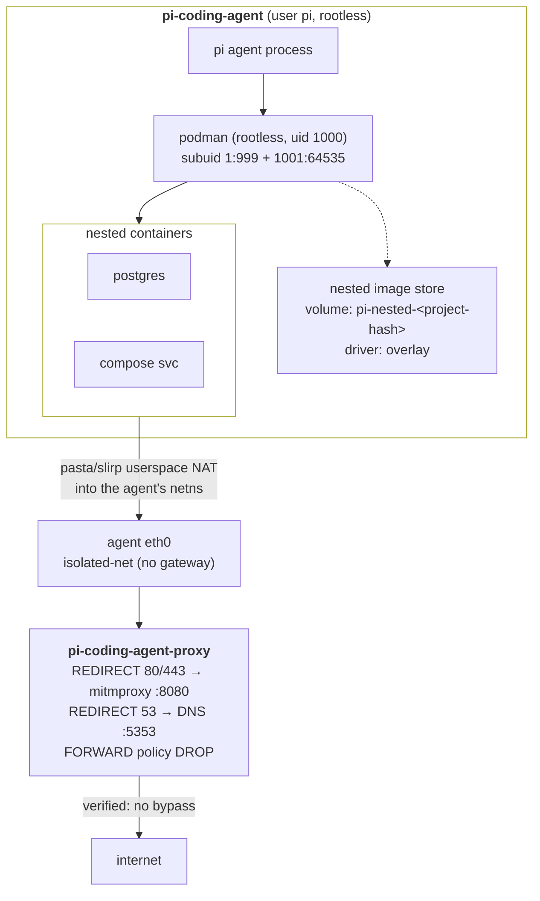

# Nested Containers — Design

Enable the `pi-coding-agent` to run containers *inside* its own container — `podman
build`, `podman run`, `docker compose up`, testcontainers-style integration tests —
without opening a path around the mitmproxy interception layer or onto the host.

**Recommendation: rootless podman-in-podman inside the agent container, and drop
Docker as a supported host runtime.** Every claim below was measured on this host
(podman 6.0.2, `applehv` machine, macOS/arm64); the commands are in
[Appendix A](#appendix-a-verification-log).

---

## Problem

The agent container is a deliberate dead end. It attaches to a single `--internal`
network with no gateway, its default route and DNS are pointed at the proxy, and the
proxy's `FORWARD` chain is default-`DROP` so only HTTP/HTTPS/DNS (transparently
REDIRECTed into mitmproxy) can leave. It runs as unprivileged `pi`, with `/home/pi`
on tmpfs so nothing persists.

None of the tooling to start a container is present:

```
$ podman run --rm --entrypoint sh pi-coding-agent:local \
    -c 'command -v newuidmap fuse-overlayfs slirp4netns pasta podman || echo NONE-OF-THESE'
NONE-OF-THESE
```

So any agent task that needs a container — run Postgres for a test, build and smoke-test
an image, `docker compose up` a dev stack — fails outright. That is a large and growing
class of ordinary development work.

Three properties must survive whatever we add:

| Invariant | Why it matters |
|---|---|
| **No uninspected egress** | Every byte the agent's workload sends must still transit mitmproxy (or a port explicitly opened in `egress.allow`). |
| **No host reachability** | The agent must not gain any handle on the host or on the host's container runtime. |
| **Agent stays non-root** | The agent process runs as `pi`; nesting must not require giving it root. |

---

## Rejected approaches

### Mounting the host runtime socket (docker-outside-of-docker)

`--volume /var/run/docker.sock:/var/run/docker.sock` is the usual answer and is
**categorically unacceptable here**. That socket is a full-privilege API to the host's
runtime. An agent holding it can run:

```
podman run -v /:/host --privileged --network host <anything>
```

…which yields the host filesystem, host networking (bypassing the proxy entirely), and
effectively host root. It doesn't weaken pi-container's isolation model, it deletes it.
This must never be offered, not even as an opt-in.

### Docker-in-Docker (`--privileged` daemon)

Classic DinD needs `--privileged` on the agent container: all capabilities, all devices,
no seccomp, no SELinux. Same objection, slightly indirected. It also can't run rootless.

### A sibling "container engine" sidecar

Run a podman-service container on the isolated network and point the agent at it via
`DOCKER_HOST=tcp://…`. This keeps the agent unprivileged, but:

- The TCP socket is the same full-privilege API as above, just aimed at the sidecar
  instead of the host — the agent can escape *into the sidecar* and take whatever the
  sidecar can reach.
- Containers it starts are **siblings**, so bind mounts of `/workspace` paths resolve in
  the sidecar's filesystem, not the agent's. Every path-based workflow (`compose` with
  relative volumes, testcontainers copying fixtures) breaks or needs the workspace
  double-mounted.
- Published ports land in the sidecar's netns, not the agent's, so `localhost:5432`
  from the agent doesn't reach them.

More moving parts, worse ergonomics, and a weaker boundary than the accepted design.

---

## Verified host baseline

Measured before designing anything, because the whole approach hinges on it:

| Property | Measured value | Consequence |
|---|---|---|
| Podman | 6.0.2, rootless=`true`, cgroup v2, systemd manager | Rootless nesting is the supported path |
| VM user | `core`, uid 501 | — |
| `/etc/subuid` (VM) | `core:100000:1000000` | 1 M subordinate UIDs available |
| Container `uid_map` | `0→501 (1)`, `1→100000 (1000000)` | Container UIDs **1…1000000** are mapped and usable for a nested range |
| `/dev/fuse`, `/dev/net/tun` | present in VM, mode `0666` | Passable via `--device` |
| SELinux | **Enforcing** | Drives the security-option decision below |
| VM RAM | **2 GiB** | tmpfs image storage is untenable (see [Storage](#3-storage-a-per-project-volume-not-tmpfs)) |
| Nested userns as uid 1000 | `unshare -U -r id` → `uid=0(root)` | **Works with no extra flags** — no `--privileged`, no seccomp change |

That last row is the important one: creating a nested user namespace needs nothing
special. Everything else is plumbing.

---

## Design: rootless podman inside the agent

The agent runs its own rootless podman as `pi`. Containers it starts are **children** —
in the agent's mount and network namespaces — so they inherit the agent's routing (hence
the proxy) and can bind-mount the agent's view of `/workspace` directly.



### 1. Host runtime flags

Added to the agent `podman run` when nesting is enabled:

| Flag | Why |
|---|---|
| `--device /dev/fuse` | `fuse-overlayfs` fallback when native rootless overlay is unavailable |
| `--device /dev/net/tun` | `pasta`/`slirp4netns` need it to create the inner tap device |
| `--security-opt label=disable` | Required on an SELinux-enforcing host — see [SELinux](#5-selinux-the-one-real-concession) |
| `--volume pi-nested-<project-hash>:/home/pi/.local/share/containers` | Persistent nested image store |
| `--env XDG_RUNTIME_DIR=/run/user/1000` | Rootless podman's lock/pid directory |
| `--env NESTED_CONTAINERS=true` | Entrypoint gate (see below) |

Notably **absent**: `--privileged`, `--security-opt seccomp=unconfined`, extra
capabilities, `--userns` overrides. Verified unnecessary — nested userns creation as
uid 1000 works under podman's default seccomp profile and default capability set. The
agent keeps its existing `NET_ADMIN` and nothing more.

### 2. Image additions

Added to `pi-coding-agent/Containerfile` (Debian trixie packages):

```dockerfile
RUN apt-get update && apt-get install -y --no-install-recommends \
      podman crun netavark aardvark-dns containers-common \
      passt slirp4netns fuse-overlayfs uidmap \
 && rm -rf /var/lib/apt/lists/*

# Nested subordinate ID ranges for `pi` (uid 1000). These must fall INSIDE the UID
# range the outer user namespace maps (verified: container UIDs 1..1000000). The
# split around 1000 mirrors quay.io/podman/stable and stays valid even on hosts with
# only the conventional 65536-wide subuid range.
RUN printf 'pi:1:999\npi:1001:64535\n' > /etc/subuid \
 && cp /etc/subuid /etc/subgid \
 # newuidmap/newgidmap need CAP_SETUID/SETGID; file capabilities are unreliable
 # across nested user namespaces, so use setuid-root (root here is the mapped
 # unprivileged host user, not real root).
 && chmod u+s /usr/bin/newuidmap /usr/bin/newgidmap
```

`~150 MB` on a `965 MB` image (≈15%). This goes in the **shared base image**, gated at
runtime by config, rather than into a separate `-nested` image variant — one image, no
build matrix, and `_compute_image_hash()` already covers `Containerfile` so project
images rebuild automatically.

### 3. Storage: a per-project volume, not tmpfs

Nested image storage **cannot** live on the agent's default paths:

- `/home/pi` is tmpfs — a multi-GB image pull would land in RAM, and this VM has
  **2 GiB** total (while `config.yaml` nominally grants the agent `16g`).
- The container's own rootfs is overlayfs, and overlay-on-overlay is unsupported —
  podman would degrade to the `vfs` driver, which copies every layer in full.

So a named volume `pi-nested-<project-hash>` is mounted at
`/home/pi/.local/share/containers`. Verified: the volume mounts correctly *nested under*
the existing `--mount type=tmpfs,…,destination=/home/pi/`, and the nested podman
resolves to the native **`overlay`** driver on it — not `vfs`.

Persisting it across runs is a deliberate exception to the ephemeral-home rule: without
it every session re-pulls every base image through mitmproxy. The volume carries the same
labels as project images (`pi-container.type=nested-storage`,
`pi-container.project.hash`, `pi-container.project.path`) so the orphan-cleanup pass in
[`run.py`](../../src/run.py) can reclaim it with the same
path-no-longer-exists rule already used for images. A `storage: tmpfs` setting is offered
for workspaces that want no persistence and have the RAM.

### 4. Egress interception is preserved — verified

This is the load-bearing security claim, so it was tested rather than reasoned about.
With the outer container attached only to an `--internal` network (no default route),
a nested container cannot reach the network *at all* — not even a raw IP:

```
$ podman run --rm --network <internal-net> --device /dev/fuse --device /dev/net/tun \
    --security-opt label=disable --user podman -v <vol>:/home/podman/.local/share/containers \
    quay.io/podman/stable sh -c 'podman run --rm alpine:3.20 sh -c "
        wget -qO- -T 6 https://example.com || echo INNER-HTTPS-FAIL;
        wget -qO- -T 6 http://1.1.1.1     || echo INNER-RAW-IP-FAIL"'
  INNER-HTTPS-FAIL (no bypass)
wget: can't connect to remote host (1.1.1.1): Network unreachable
  INNER-RAW-IP-FAIL (no bypass)
```

`Network unreachable` comes from the kernel's routing layer in the *agent's* netns.
Rootless podman connects its containers through `pasta`/`slirp4netns`, which perform
userspace NAT **into the parent namespace's stack** — so nested traffic is emitted from
the agent's own interface, with the agent's source address, subject to the agent's routes.
The proxy's existing `-i eth1` REDIRECT rules therefore match nested traffic with **no
proxy-side changes at all**.

For reference, on a normal (routed) network the same nested container gets a working
stack — its own bridge address, `aardvark-dns` at `169.254.1.1`, and successful HTTPS.
Inside pi-container that inner resolver forwards to the agent's `resolv.conf`, which
points at the proxy: DNS interception survives, one hop deeper.

Two honest consequences:

- **`/dev/net/tun` + `NET_ADMIN` does not create egress.** The agent can build tunnels in
  its own netns, but there is still exactly one way off the isolated network — the proxy —
  and the proxy's `FORWARD` policy is `DROP`.
- **Flow attribution coarsens.** `flow_export` partitions captured flows by client IP;
  nested-container flows carry the agent's IP, so they are indistinguishable from the
  agent's own. Documented, not fixed — distinguishing them would require per-inner-container
  addressing on the isolated net, which the sibling-sidecar design would need anyway.

### 5. SELinux: the one real concession

The host runs SELinux in **Enforcing** mode, and `/dev/net/tun` is inaccessible under the
default container label. The full matrix, measured:

| Agent label | Inner container flags | Result |
|---|---|---|
| default (`container_t`) | — | `/dev/net/tun`: **Permission denied** |
| `label=type:container_engine_t` | — | inner container fails: `crun: mount tmpfs to proc/acpi: Permission denied` |
| `label=type:container_engine_t` | `--security-opt label=disable` | same failure |
| `label=type:container_engine_t` | `--security-opt unmask=all` | **works** |
| `label=disable` | — | **works** |

`container_engine_t` is the SELinux type designed for running a container engine inside a
container, and it is the better posture — the agent stays confined. But it only works if
**every** nested container passes `--security-opt unmask=all`, and that cannot be made
transparent: `unmask` is not a `containers.conf` key (a drop-in setting it is silently
ignored — confirmed, while `env` in the same drop-in took effect). Requiring an explicit
flag on every inner run breaks exactly the workflows this feature exists for
(`docker compose up`, testcontainers, anything driving the API socket).

**Decision:** default to `label=disable`, and expose `security: engine_t` in config for
workspaces that accept passing `--security-opt unmask=all` to their inner containers.

What `label=disable` actually costs: the agent container loses SELinux *type* confinement.
It does **not** lose the user namespace (container uid 0 is still the unprivileged VM user
`core`), rootlessness, seccomp, the capability bounding set, the routing dead end, or the
absence of any host socket. SELinux here was defense-in-depth against a runtime/kernel
escape; the primary boundaries are all intact. This is a genuine reduction and belongs in
the docs as one — which is why nesting is **opt-in and off by default**.

### 6. Trusting the mitmproxy CA inside nested containers

Two separate problems.

**The nested engine itself** talking to registries: podman reads the agent container's
system trust store, where `build.sh` already installs the mitmproxy CA. Works unmodified.

**Processes inside nested containers**: an arbitrary image (`alpine`, `postgres`) has no
idea about the mitmproxy CA, so every TLS call from inside it fails. Fixed with a
`containers.conf` drop-in that injects the CA into *every* nested container. Both
mechanisms verified working:

```toml
# /etc/containers/containers.conf.d/50-pi-container.conf
# Baked into the image at /etc (NOT under /home/pi — that path is tmpfs at runtime and
# would mask anything the image shipped there).
[containers]
mounts = [
  "type=bind,source=/etc/ssl/certs/ca-certificates.crt,destination=/etc/pi-container-ca.crt,ro=true",
]
env = [
  "SSL_CERT_FILE=/etc/pi-container-ca.crt",
  "NODE_EXTRA_CA_CERTS=/etc/pi-container-ca.crt",
  "REQUESTS_CA_BUNDLE=/etc/pi-container-ca.crt",
  "CURL_CA_BUNDLE=/etc/pi-container-ca.crt",
  "GIT_SSL_CAINFO=/etc/pi-container-ca.crt",
]

[engine]
# No cgroup delegation inside the agent container; systemd/dbus are absent.
cgroup_manager = "cgroupfs"
```

Note `mounts`, not `volumes` — `[containers] volumes` is silently ignored (wrong key;
verified). The mounted file is the agent's **full** bundle (system CAs *plus* the
mitmproxy CA), so pointing `SSL_CERT_FILE` at it is strictly additive.

Limitation worth documenting: this covers tools that honour `SSL_CERT_FILE` or those env
vars (OpenSSL, Go, Node, Python-requests, curl, git). A tool that only reads a hardcoded
`/etc/ssl/certs/…` path in its own image still fails, and the fix is per-image (`COPY` the
CA in a Dockerfile stage). Unavoidable without rewriting arbitrary images.

### 7. Registry allowlist

The proxy's allowlist is `default_action: block`, so nesting is useless until registry
hosts are permitted. Ship a **commented-out** block in the seeded
`allowlist.yaml` (commented so enabling nesting is a deliberate two-step, matching how
`egress.allow` ships all-false):

```yaml
    # Uncomment when nested_containers.enabled = true. Registry pulls are HTTPS and
    # are inspected by mitmproxy like any other traffic.
    # - name: "container-registries-allow"
    #   mode: "allow"
    #   hostnames:
    #     - "registry-1.docker.io"
    #     - "auth.docker.io"
    #     - "production.cloudflare.docker.com"
    #     - "*.docker.io"
    #     - "ghcr.io"
    #     - "*.ghcr.io"
    #     - "pkg-containers.githubusercontent.com"
    #     - "quay.io"
    #     - "*.quay.io"
    #     - "gcr.io"
    #     - "*.gcr.io"
    #   ip_ranges: []
```

### 8. Resource limits

Nested containers are processes in the agent's cgroup, so `resources.agent.memory/cpus`
already bounds them in aggregate — a nested workload cannot exceed the agent's budget.

Per-inner-container limits (`podman run --memory=…` *inside* the agent) will **not** work:
rootless podman in a container has no delegated cgroup subtree. `cgroup_manager = "cgroupfs"`
above avoids a hard failure on the missing systemd/dbus; inner limit flags are then
best-effort. Documented as a known limitation.

One operational note surfaced by the baseline: the VM has 2 GiB of RAM while the default
`resources.agent.memory` is `16g`. That mismatch is pre-existing and harmless today, but
nested builds are the workload most likely to expose it. The docs should tell users to size
`podman machine` before enabling nesting.

### 9. Entrypoint changes

`pi-coding-agent/entrypoint.sh` runs as root before `gosu pi`, which is the right place for
the one setup step that needs it:

```bash
# ─── Nested container support (NESTED_CONTAINERS, injected by run.py) ─────
# Rootless podman needs a private XDG_RUNTIME_DIR for its locks and pid files.
# Created here (as root, pre-gosu) because the agent runs as pi.
if [ "${NESTED_CONTAINERS}" = "true" ]; then
    mkdir -p /run/user/1000
    chown pi:pi /run/user/1000
    chmod 700 /run/user/1000
    # The volume mounted at ~/.local/share/containers may be freshly created and
    # root-owned; pi must own its own image store.
    chown pi:pi /home/pi/.local/share/containers 2>/dev/null || true
fi
```

### 10. Configuration surface

New top-level section in `.pi-container/config.yaml`:

```yaml
# Nested containers. When enabled, the agent can run its own containers (podman /
# docker compose / testcontainers) inside the agent container, as rootless podman.
#
# Traffic from nested containers still egresses through the proxy and is inspected
# by mitmproxy — nesting does NOT create a bypass. But enabling this DOES relax the
# agent container's SELinux confinement (see docs/design/nested-containers.md) and
# grants /dev/fuse + /dev/net/tun. Off by default.
#
# Registry hosts must also be allowed in allowlist.yaml, or image pulls will 403.
nested_containers:
  enabled: false
  # Where nested image layers live:
  #   volume → persistent per-project named volume (default; survives runs)
  #   tmpfs  → volatile RAM disk (needs a large podman machine; re-pulls each run)
  storage: volume
  # SELinux posture for the agent container:
  #   disable  → label=disable (default; nested containers need no special flags)
  #   engine_t → label=type:container_engine_t (agent stays confined, but every
  #              nested container must be run with --security-opt unmask=all)
  security: disable
```

`schema_common.py::SCHEMA` gains the matching entry and `schema_version` is bumped (the
template changed, so existing workspaces must re-seed — the existing failure message
already explains how).

---

## Dropping Docker

Nesting does not *technically* require removing Docker — the nesting happens inside the
agent container regardless of which runtime started it. Removing it is still the right
call, for three reasons.

**1. Docker has no user namespace by default.** Every verified result above rests on the
agent container's `uid_map` (`0→501`) — container root is an unprivileged host user. Under
stock Docker there is no remap: container uid 0 *is* host uid 0. The flag set this design
needs (`/dev/fuse`, `/dev/net/tun`, relaxed SELinux, a nested container engine) is
well-contained under a userns and is a credible host-escape surface without one. Shipping
the same feature on both runtimes would mean shipping two materially different security
guarantees under one config flag.

**2. `DockerRuntime` is already unverified.** Its own docstring in
[runtimes.py](../../src/runtimes.py) says "Untested here (no docker binary on this host)",
and it relies on `--network` ordering to land the isolated network on `eth1` because Docker
has no per-attachment interface naming. On this machine `docker` is a shell alias to
`podman`. Adding a security-sensitive feature to a code path nobody exercises is how the
guarantee quietly becomes false.

**3. Rootless nesting is a first-class podman feature.** `--userns`, `newuidmap` in the
container, `pasta`, `containers.conf` drop-ins, and rootless nested overlay are podman
mechanisms with an upstream-maintained reference image. On Docker the equivalent is
`--privileged` DinD, already rejected.

What removal deletes:

- `DockerRuntime` and its registry entry in `ContainerRuntime.create()`.
- `proxy_secondary_connect_argv()` — the abstract hook exists *only* because
  `docker run` attaches one network, so the whole post-run `network connect` step in
  `network.py::_actually_start()` goes with it.
- Docker branches in `validate_environment()`, plus `docker`-specific docs and env vars.

`ContainerRuntime` should stay as an abstraction (`PodmanRuntime` remains the single
subclass) rather than being flattened into `run.py` — it is the seam where a future
runtime would attach, and collapsing it would be a large diff for no gain.

---

## Edge cases

| Scenario | Behavior |
|---|---|
| `nested_containers.enabled: false` (default) | No new flags, no volume, no entrypoint work. Only cost is the toolchain's ~150 MB in the image. |
| Nesting enabled, registries not allowlisted | Pulls fail with mitmproxy's 403. Needs a clear log line at startup — see [Open questions](#open-questions). |
| Nested container tries to reach the internet directly | Impossible — verified `Network unreachable`. Proxy is the only route. |
| Nested container publishes a port | Binds in the agent's netns; reachable from the isolated network only, never from the host. |
| Nested container bind-mounts `/workspace/...` | Works — nested containers are children in the agent's mount namespace. Cannot reach beyond what the agent already sees. |
| TLS from inside a nested container | Works for tools honouring `SSL_CERT_FILE`/`NODE_EXTRA_CA_CERTS`/etc. Images with a hardcoded bundle path need a per-image `COPY`. |
| `storage: volume`, project directory deleted | Volume is labelled with `pi-container.project.path`; the orphan-cleanup pass reclaims it exactly as it does project images. |
| `storage: tmpfs` on the 2 GiB default machine | First sizeable pull hits OOM. Docs must state the machine-sizing requirement. |
| Concurrent runs in the same workspace | Both mount the same nested-storage volume. Podman's own storage locks (in the per-run `XDG_RUNTIME_DIR`) do **not** span containers — see [Open questions](#open-questions). |
| Inner `podman run --memory=…` | Best-effort; no cgroup delegation. Aggregate limit from `resources.agent` still applies. |
| Host is a Linux machine with `user:100000:65536` | The `pi:1:999` + `pi:1001:64535` split stays inside the mapped range by construction. A wider range would not. |

---

## Implementation phases

1. **Podman-only.** Remove `DockerRuntime`, `proxy_secondary_connect_argv()`, the
   post-run `network connect` step, and the docker branches in `validate_environment()`.
   No behavior change on podman. Independently reviewable and shippable.
2. **Image toolchain.** Containerfile packages, `/etc/subuid` + `/etc/subgid`, setuid on
   `newuidmap`/`newgidmap`, the `containers.conf` drop-in. Verify a nested
   `podman run` end-to-end from a shell in the agent container.
3. **Orchestration.** `nested_containers` config + schema + `schema_version` bump,
   `PodmanRuntime.nested_container_args()`, volume create/label/orphan-cleanup,
   entrypoint block.
4. **Docs + allowlist.** Commented registry block, `configuration.md`, an
   `architecture.md` section, and an explicit security note that enabling nesting relaxes
   SELinux confinement.

Each phase leaves the tree working; the security-relevant surface all lands in 3.

---

## Files changed

| File | Change |
|---|---|
| `src/runtimes.py` | Delete `DockerRuntime` + registry entry + `proxy_secondary_connect_argv()`. Add `PodmanRuntime.nested_container_args(cfg, project_hash) -> list[str]` returning the device/security/volume/env flags. Update the module docstring (it currently documents two runtimes). |
| `src/network.py` | Delete the `proxy_secondary_connect_argv()` call in `_actually_start()`. Add `read_nested_containers_config()`. |
| `src/run.py` | Call `read_nested_containers_config()`; splice `nested_container_args()` into `pi_container_cmd`. Add `_ensure_nested_volume()` (create + label) and `_cleanup_orphaned_nested_volumes()` mirroring `_cleanup_orphaned_project_images()`. |
| `src/util.py` | `validate_environment()`: podman-only. |
| `src/schema_common.py` | `SCHEMA` gains `nested_containers` (`enabled`, `storage`, `security`). |
| `pi-coding-agent/Containerfile` | Nesting toolchain packages; `/etc/subuid`/`/etc/subgid`; setuid `newuidmap`/`newgidmap`; `/etc/containers/containers.conf.d/50-pi-container.conf`. |
| `pi-coding-agent/entrypoint.sh` | `NESTED_CONTAINERS` block creating/chowning `/run/user/1000` and the store. |
| `pi-coding-agent/default/config.yaml` | New `nested_containers` section; bump `schema_version`. |
| `pi-coding-agent/default/allowlist.yaml` | Commented registry allow-rule block. |
| `docs/configuration.md`, `docs/architecture.md`, `docs/getting-started.md` | Document the section, the trust model change, machine sizing; drop Docker references. |
| `src/tests/test_runtimes.py` | Remove `DockerRuntime` tests; add `nested_container_args()` tests (flags present when enabled, absent when disabled, `engine_t` vs `disable`). |
| `src/tests/test_network.py`, `src/tests/test_run.py` | `read_nested_containers_config()` defaults/parsing; nested-volume lifecycle + orphan cleanup. |
| `src/tests/test_config_schema.py` | Schema entry + `schema_version` bump. |
| `CHANGELOG.md` | Added (nesting), Changed/Removed (Docker support — a breaking change; warrants a minor version bump). |

---

## Open questions

1. **Startup warning for un-allowlisted registries.** When `nested_containers.enabled`
   is true, `run.py` could scan `allowlist.yaml` for any registry hostname and log a
   warning if none is present. Cheap, and turns a confusing mid-session 403 into a
   startup hint. Recommend including in phase 4.
2. **Concurrent runs sharing one nested-storage volume.** Two agents in the same
   workspace both mount `pi-nested-<hash>`, and each has its own `XDG_RUNTIME_DIR`, so
   podman's storage locks don't see each other — a plausible route to a corrupted store.
   Options: per-run volumes (loses cache sharing), a run-scoped subdirectory inside the
   shared volume (keeps the layer cache separate but the disk shared), or refcount the
   volume like the proxy already is. Needs a decision before phase 3; the subdirectory
   option looks cheapest.
3. **Should `storage: tmpfs` exist at all?** It only works on a large `podman machine`
   and re-pulls every session. It may be more honest to ship `volume` only and let users
   who want ephemerality delete the volume.
4. **Nested-container flow attribution.** Accepting the agent's IP for all nested flows
   is the phase-1 answer. If per-container attribution is later wanted, it needs inner
   containers addressable on the isolated network — a much larger change, and one that
   would reopen the sibling-sidecar tradeoff.
5. **Does `pi` need a `docker` alias?** Many tools shell out to `docker` specifically.
   A `docker → podman` shim (podman ships `podman-docker` on Debian) plus a
   `DOCKER_HOST` pointing at a user socket would make `docker compose` work unmodified.
   Small addition; worth confirming which the agent actually invokes.

---

## Appendix A: verification log

Every command below was run on this host (podman 6.0.2, `applehv`, macOS/arm64). The
reference image `quay.io/podman/stable` was used to test the nested engine before the
agent image carries the toolchain; it was removed afterwards.

```bash
# ── Baseline ────────────────────────────────────────────────────────────────
podman info --format '{{.Host.Security.Rootless}}'                 # true
podman machine ssh 'cat /etc/subuid; ls -l /dev/fuse /dev/net/tun; getenforce'
#   core:100000:1000000 | both crw-rw-rw- | Enforcing
podman machine ssh 'stat -fc %T /sys/fs/cgroup'                    # cgroup2fs

# ── Nesting primitives, in the real agent image ─────────────────────────────
podman run --rm --entrypoint cat pi-coding-agent:local /proc/self/uid_map
#   0 501 1  /  1 100000 1000000     → container UIDs 1..1000000 are mapped
podman run --rm --user pi --entrypoint unshare pi-coding-agent:local -U -r id
#   uid=0(root) — nested userns works as uid 1000, no extra flags
podman run --rm --entrypoint sh pi-coding-agent:local \
  -c 'command -v newuidmap fuse-overlayfs slirp4netns pasta podman || echo NONE-OF-THESE'
#   NONE-OF-THESE → toolchain must be added

# ── SELinux matrix (device access) ──────────────────────────────────────────
# default label      → /dev/net/tun: Permission denied
# label=type:container_engine_t → BOTH-OPEN-OK
# label=disable                 → BOTH-OPEN-OK

# ── Nested engine ───────────────────────────────────────────────────────────
podman run --rm --device /dev/fuse --security-opt label=disable --user podman \
  quay.io/podman/stable podman info --format '{{.Store.GraphDriverName}}'
#   overlay  (native rootless overlay, not vfs)

# inner container, routed network: bridge IP 10.88.0.35, aardvark DNS
# 169.254.1.1, HTTPS-OK

# ── No-bypass proof (outer on --internal, no default route) ─────────────────
#   INNER-HTTPS-FAIL / "Network unreachable" to raw 1.1.1.1

# ── SELinux matrix (full nested run) ───────────────────────────────────────
# engine_t, plain inner              → crun: mount tmpfs to proc/acpi: Permission denied
# engine_t + inner label=disable     → same failure
# engine_t + inner unmask=all        → INNER-STARTED-OK
# label=disable, plain inner         → INNER-STARTED-OK

# ── containers.conf drop-in (/etc/containers/containers.conf.d/) ────────────
# [containers] env=[...]     → propagates to every inner container   ✅
# [containers] mounts=[...]  → auto-mounts into every inner container ✅
# [containers] volumes=[...] → silently ignored (wrong key)           ❌
# [containers] unmask=[...]  → silently ignored (not a config key)    ❌

# ── Storage layout ─────────────────────────────────────────────────────────
# named volume at /home/pi/.local/share/containers, mounted UNDER
# --mount type=tmpfs,notmpcopyup,destination=/home/pi/ → content visible, WRITE-OK
```
