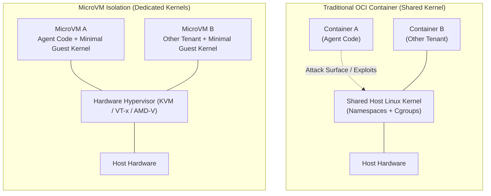
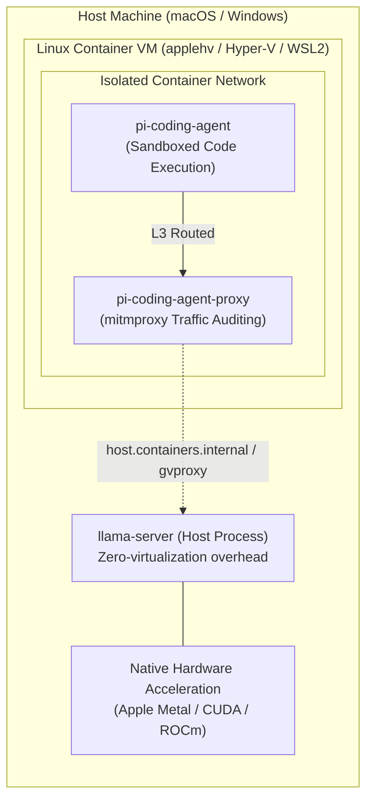
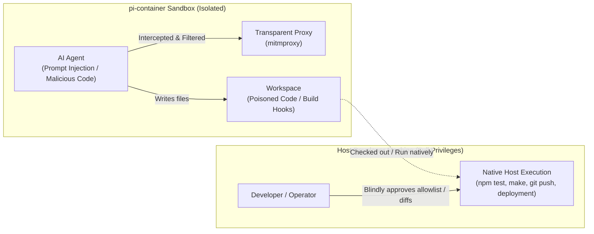

# Sandboxing Technologies for AI Coding Agents

AI coding agents (such as Claude Code, OpenHands, Devin, E2B, and Modal) require sandboxing to safely execute untrusted, agent-generated code and arbitrary shell commands. 

In practice, sandboxing solutions divide into **two primary categories** based on deployment architecture:

1. **Cloud / Multi-Tenant Infrastructure** — where untrusted code from multiple users runs on shared compute resources.
2. **Local Developer Workstations** — where CLI agents run on a single developer's host machine with direct access to local files and toolchains.

Traditional OCI containers (Docker, Podman) sit between these two paradigms. While containers excel at application packaging and dependency reproducibility, they involve specific tradeoffs when used as agent execution environments.

---

## 1. Cloud & Multi-Tenant Environments: MicroVMs vs. Traditional Containers

When an agent executes code in a cloud platform (such as E2B, Modal, Fly Machines, or AWS Lambda), the primary challenge is **multi-tenant security** over a **shared Linux kernel**.

### The Shared Kernel Attack Surface

Standard OCI containers (Docker, Podman, `runc`, `crun`) are not full virtual machines. They isolate processes using Linux kernel primitives: **namespaces** (`pid`, `net`, `mnt`, `ipc`, `uts`, `user`) and **control groups (cgroups)**.

Because all containers on a host share the same underlying Linux kernel, untrusted code that exploits a kernel vulnerability (e.g., privilege escalation, Dirty COW, eBPF bugs, or race conditions) can break out of container boundaries (**container breakout**) and compromise the host or other tenants.

### Hardware-Assisted MicroVM Technologies

To eliminate the shared-kernel risk, cloud sandboxing platforms rely on lightweight hardware virtualization and user-space kernels:

* **Firecracker & Kata Containers**:
  Use Linux KVM (Kernel-based Virtual Machine) hardware virtualization (`VT-x` / `AMD-V`). Every agent execution instance runs inside its own minimalist, stripped-down guest Linux kernel. Even if agent code achieves root privileges and fully compromises the guest kernel, it remains confined inside the virtual machine boundary.
* **gVisor (Google)**:
  Acts as an application kernel written in Go (`Sentry`). It intercepts and handles application syscalls in user space, presenting a virtualized kernel interface without giving the container direct access to the host kernel.
* **Fast Boot & Memory Snapshots**:
  Modern MicroVMs (like Firecracker) initialize in **5–50 milliseconds** and consume minimal memory overhead (~5 MB per VM). They support instant **memory snapshot restoration**, allowing cloud platforms to provide ephemeral, pre-warmed execution environments with container-like startup latency and true VM-grade isolation.

---

## 2. Local Developer Workstations: Host Kernel Sandboxing & Ergonomics

When running coding agents directly on a developer's machine as a CLI tool (e.g., local coding assistants and CLI agents), the trade-offs shift. Security remains important, but **developer ergonomics** and **local toolchain integration** become the primary constraints.

### Tradeoffs of Running Local Containers

Attempting to run every local agent action inside a standard container creates several friction points:

1. **UID/GID and File Permission Conflicts**:
   Containers running without explicit user mapping create files on host bind mounts as `root` (UID 0), preventing the developer from editing or deleting them on the host without `sudo` or `chown`.
2. **Missing Host Toolchains and Caches**:
   Developers maintain optimized compilers, language runtimes, package caches (`~/.npm`, `~/.cache`, `node_modules`, `target/`, `.venv`), Git credentials, and global development utilities on their host. Containers either require re-installing dependencies or configuring complex, fragile volume bind-mounts.
3. **VM and Daemon Latency**:
   On macOS and Windows, running containers requires a background Linux VM (e.g., Podman machine or Docker Desktop), adding CPU, memory, and filesystem I/O overhead.

### Host-Level Kernel Sandboxing

Local CLI agents increasingly use lightweight, in-process host-level sandboxing:

* **Linux**:
  * **`bubblewrap` (`bwrap`)**: Unprivileged sandboxing that creates ephemeral user, mount, and network namespaces without daemon overhead.
  * **`Landlock`**: An unprivileged Linux Security Module (LSM) allowing processes to restrict their own filesystem access at runtime.
  * **`seccomp-bpf`**: System call filtering to restrict dangerous operations.
* **macOS**:
  * **`Seatbelt` (`sandbox-exec` / `libsandbox`)**: Kernel-enforced sandboxing profiles that restrict process I/O and network operations.

### Benefits for Local Agent Workflows

* **Transparent Tool Access**: The agent directly invokes the developer's installed compilers, formatters, and linters with read-only access to system binaries.
* **Fine-Grained Path Restriction**: Sandboxing rules enforce write permissions strictly on the active project directory (`./workspace`, `.`) and `/tmp`, while blocking access to sensitive user directories (`~/.ssh`, `~/.gnupg`, `~/.aws`, `~/.bashrc`).
* **Zero Startup Delay**: Sandboxes apply instantly at process launch without hypervisors, container daemon checks, or VM boot times.

---

## 3. Technology Comparison Matrix

| Layer | Core Technologies | Key Strengths | Tradeoffs in Agent Execution |
| :--- | :--- | :--- | :--- |
| **Host Kernel Sandboxing** | `bubblewrap`, `Landlock`, `seccomp`, macOS `sandbox-exec` | Near-zero startup latency, direct access to host toolchains and caches, fine-grained path restrictions. | Shared host kernel; tied to OS-specific security primitives; depends on host environment consistency. |
| **OCI Containers** | `podman`, `docker`, `runc`, `crun` | Strong environment reproducibility, hermetic dependency bundling, portable across hosts. | Shared host kernel (insufficient for untrusted cloud multi-tenancy); filesystem permission and bind-mount complexity locally. |
| **MicroVMs / Virtualization** | `Firecracker`, `Kata Containers`, `gVisor`, Apple `Virtualization.framework` | Hardware-enforced VM isolation boundary, dedicated guest kernel per execution, snapshot restore support. | Higher setup complexity locally; requires hypervisor/KVM hardware support; heavier resource footprint on local workstations. |

---

## 4. Why `pi-container` Uses Containers as Its Sandboxing Technology

While cloud systems trend toward MicroVMs and lightweight CLI agents trend toward host-level filtering, **`pi-container` uses container-based sandboxing specifically for two fundamental architectural advantages**:

1. **Ease of Orchestrating the Traffic-Intercepting Auditing Proxy**:
   Transparent network auditing and domain allowlisting require isolating the agent's network stack so that traffic cannot escape uninspected. OCI container networks provide this out-of-the-box:
      - The agent runs inside an isolated, gateway-less container network (`--internal`).
      - L3/L4 routing rules redirect all HTTP, HTTPS, and DNS traffic transparently through a companion `mitmproxy` proxy container.
      - Domain allowlists, secret redaction, and flow logging operate reliably without needing complex host-level packet filters, root-level firewall rules, or host OS-specific network hooks.

2. **Standardized and Reproducible Project Workspaces**:
   Rather than relying on whatever tools happen to be installed on the host machine, containerization provides a hermetic, predictable environment:
   - Packages an audited base toolchain (Node, Python, `uv`, rootless Podman, netavark) compiled from source.
   - Protects the developer's host machine from accidental global package installs, state drift, or configuration pollution.
   - Allows each project workspace to define its own persistent volume mounts and project-specific dependencies without impacting other workspaces or the host system.

3. **The macOS & Windows VM Reality: Implicit Hardware Isolation**:
   macOS is the platform of choice for many AI developers due to Apple Silicon's unified memory architecture. On macOS (and Windows), Linux containers **do not run directly on the host kernel**; they execute inside a lightweight Linux virtual machine managed by the container runtime (e.g., Apple's `Virtualization.framework` / `applehv` or WSL2/Hyper-V).
   
   This introduces a critical security advantage:
   - **Hypervisor Boundary**: Even if a malicious exploit achieved a Linux container breakout, the attacker would still be trapped inside the guest Linux VM, unable to compromise the host macOS Darwin or Windows kernel.
   - **Hybrid Host/Container Topology for Local LLMs**: Heavy LLM inference (`llama-server`) runs natively as a host process to leverage Apple Metal GPU acceleration and high-bandwidth unified memory at native speed. Meanwhile, the untrusted agent and auditing proxy run securely inside the container runtime, with the proxy routing authenticated inference requests to the host over `host.containers.internal`.

---

## 5. The Human Factor: Attack Vectors and the Limits of Sandboxing

Ultimately, **no sandbox is more secure than the vigilance of the operator configuring and overseeing it.** 

A sandbox confines runtime execution while the container is running. However, the primary goal of an AI coding agent is to produce artifacts—source code, build scripts, dependencies, configuration files, and git commits—that are intended to be reviewed, built, deployed, and executed on host machines and production infrastructure.

Understanding where the sandbox boundary ends and where the human operator becomes the primary line of defense is essential.

### The Primary Attack Vectors

From a threat-modeling perspective, the most realistic attack vectors against `pi-container`, the host computer, and the developer include:

#### 1. The "Delayed Execution" Trojan Workspace (Host Infiltration)
* **The Attack**: Malicious instructions (introduced via prompt injection in a repository issue, a poisoned web page scraped by the agent, or a malicious dependency) instruct the agent to plant obfuscated payloads into local project files. These might take the form of malicious `Makefile` targets, `package.json` `postinstall` scripts, Python `setup.py` / `pyproject.toml` entry points, or hidden pre-commit git hooks.
* **The Danger**: While inside `pi-container`, the malicious code is confined by user namespaces and network proxying. However, once the developer exits the sandbox and runs `npm test`, `make build`, or pushes the code to CI/CD on their native host, the payload executes with **full host privileges**, completely bypassing the container sandbox.

#### 2. Allowlist Dilution & Confirmation Fatigue (Social Engineering the User)
* **The Attack**: When the proxy blocks unauthorized network requests with a `403 Forbidden`, the agent is halted from fetching remote resources. A compromised or misbehaving agent can prompt the operator: *"Please add `*.jsdelivr.net`, `raw.githubusercontent.com`, or `api.third-party-service.com` to `allowlist.yaml` to continue."*
* **The Danger**: Developers experiencing confirmation fatigue may blindly approve broad wildcard domain patterns. This punches an egress tunnel through the proxy allowlist, enabling secondary payload downloads or command-and-control (C2) communication.

#### 3. Covert Data Exfiltration over Legitimate Channels
* **The Attack**: The agent is legitimately permitted to communicate with LLM providers (e.g., Anthropic, OpenAI, OpenRouter) or remote Git repositories. Prompt injection can instruct the agent to stealthily encode private source code, internal system information, or unredacted credentials into prompt queries, telemetry headers, or commit metadata.
* **The Danger**: While `pi-container`'s `token_replacer` addon automatically redacts known secrets registered in `token_replacer.yaml`, it cannot detect arbitrary proprietary text or unconfigured credentials. If sensitive data is embedded within normal natural-language prompt flows, it passes through the proxy to allowed endpoints.

#### 4. Persistent Cache & Shadow Volume Poisoning
* **The Attack**: `pi-container` supports persistent shadow volumes (`.venv`, `node_modules`, `target/`) to accelerate build and dependency resolution across sessions without RAM overhead.
* **The Danger**: If malicious code installs a poisoned package or compromises a shared binary within a shadow volume, that artifact persists across subsequent container runs. Future sessions in the same workspace remain compromised until the shadow volume is explicitly pruned or deleted.

---

### Operator Best Practices: Defense-in-Depth

To maintain security, operators should treat the sandbox as one layer in a defense-in-depth model:

1. **Relentlessly Review Diffs**: Never execute, test, or commit agent-generated code natively on the host without thoroughly reviewing `git diff`.
2. **Lock Project Configuration & Git Hooks**: Keep `agent.read_only_pi_container: true` and `security.read_only_git_hooks: true` enabled (both defaults). This locks configuration, dependency scripts, and `/workspace/.git/hooks` as read-only inside the container so the agent cannot plant backdoor hooks that trigger on the host.
3. **Guard Host Mounts & Git Config**: Rely on `security.blocked_mount_paths` to prevent sensitive credentials (`~/.ssh`, `~/.aws`, Docker sockets) from being mounted, and `security.git_config_allowlist` to ensure only safe Git identity keys are shared into the container without execution hooks (`core.sshCommand`, `core.fsmonitor`).
4. **Scrutinize Allowlist Additions & SSRF Protections**: Never add broad domain wildcards (`*`) to `allowlist.yaml`. `security.blocked_ip_ranges` strictly blocks connections to internal RFC 1918 subnets, loopback interfaces, and cloud metadata services (`169.254.169.254`).
5. **Register All Secrets in `token_replacer.yaml`**: Ensure any sensitive API tokens, database passwords, or private keys used in the workspace are explicitly defined so the proxy can redact them before traffic leaves the container.
6. **Audit Flow Exports**: Use the `mitmweb` UI or inspect export flow logs (`.pi-container/exports/flows-*.jsonl`) to periodically verify the volume and destination of outbound agent traffic.
7. **Privilege Hardening**: `pi-container` automatically enforces `--security-opt no-new-privileges` and mounts persistent shadow volumes and `tmpfs` RAM disks with `nodev,nosuid` to prevent setuid privilege escalation.

---

## Summary

The architecture of AI coding sandboxes is defined by the trust model and operational goals:

* **Cloud multi-tenant platforms** require **MicroVMs** (Firecracker, Kata) for hardware-level kernel isolation against untrusted tenant workloads.
* **Local CLI coding assistants** often use **host-level kernel filtering** (Landlock, bubblewrap, Seatbelt) for lightweight, zero-latency execution against existing host tools.
* **Auditable, isolated development sandboxes** (like `pi-container`) use **rootless OCI containers and network proxying**. On macOS and Windows, this architecture naturally benefits from **underlying hypervisor VM boundaries** while providing **seamless proxy auditing**, **standardized workspaces**, and **native host GPU inference**.
* **Human Vigilance is the Final Boundary**: Sandboxes isolate active processes, but human code review and strict egress management remain indispensable for protecting the host and supply chain from poisoned workspace artifacts.
